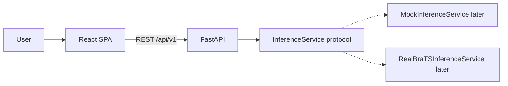
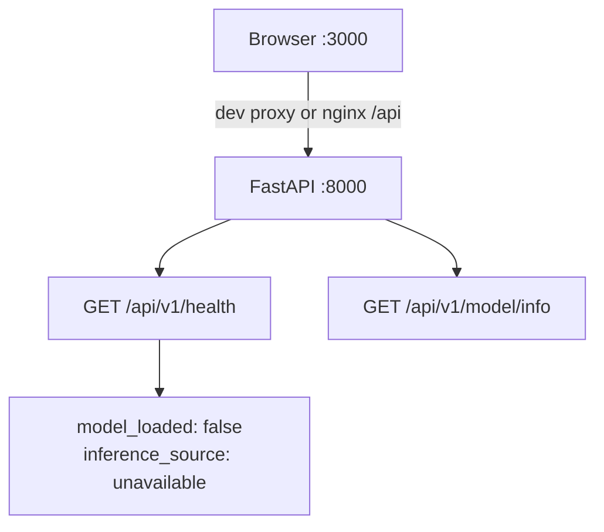

# Architecture — Phase 1

Research / decision-support prototype. **Not a diagnostic device. Not clinically validated.**

## Boundary

The production application serves cases, visualization, and reports. Training stays in a separate notebook/research pipeline. This repository's web stack must not train models.



Phase 1 implements the left side only: frontend shell, FastAPI process, configuration, health, and the `InferenceService` interface. No upload, jobs, mock predictions, or checkpoint loading.

## Runtime (Phase 1)



## Replaceable inference

`backend/app/inference/base.py` defines:

```text
InferenceService.predict(case) -> result
```

The frontend never knows whether a future result came from a mock, local PyTorch, or a remote GPU server. Phase 1 does not register an implementation.

## Configuration

All paths and origins come from environment variables (`pydantic-settings`). `MODEL_PATH` is reserved for Phase 6. Setting it in Phase 1 does **not** load weights and does **not** change `model_loaded`.

## What is intentionally absent

- MRI upload and NIfTI validation
- SQLite / PostgreSQL
- Job queue and mock segmentation
- 2D/3D viewers and reports
- `ml/` training code
