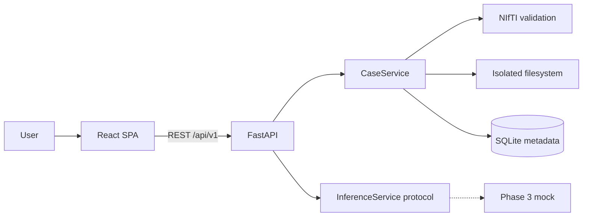

# Architecture — Phase 2

Research / decision-support prototype. **Not a diagnostic device. Not clinically validated.**

## Boundary

Training stays in a separate notebook. This application validates and stores BraTS NIfTI cases. It does **not** run inference in Phase 2.



## Public API

PRD ingest endpoints remain:

- `POST /api/v1/predict` — four modalities; validates and stores
- `POST /api/v1/evaluate` — four modalities plus `seg`; validates and stores

Phase 2 **does not** return `202` with a `job_id`. That would imply a queued inference job. These endpoints return **201** with `job_id: null`, `status: READY`, and `inference: not_started`.

Upload UX needs per-file progress, so these case endpoints are **additive** (not a competing product API):

- `POST /api/v1/cases`
- `POST /api/v1/cases/{case_id}/files/{modality}`
- `POST /api/v1/cases/{case_id}/complete`
- `GET /api/v1/cases/{case_id}`

## Frontend (`frontend/`)

-   **React + TypeScript + Vite**: Built on standard tooling with `Tailwind CSS` for styling.
-   **Routing**: Client-side routing for navigating cases, jobs, and the viewer.
-   **API Client**: Standardized fetch wrapper (`src/lib/api.ts`) managing the upload lifecycle and file fetching.
-   **State Management**: React local state for UI transitions; URL parameters drive case/job lookup.

**Phase 4 Visualization Component**:
The visualization architecture uses an entirely in-browser NIfTI parsing and rendering engine without requiring external medical imaging servers (like Orthanc/PACS).
-   **Parsing**: `nifti-reader-js` decodes `.nii.gz` binary artifacts directly into raw Float32 arrays, preserving spatial Affine headers and spacing.
-   **2D Multiplanar Slicing**: Custom libraries (`src/lib/sliceExtraction.ts`) extract arbitrary Ax/Cor/Sag slices from the 1D flat arrays, performing percentile window normalization and HTML Canvas 2D rendering for performance.
-   **Coordinate Convention**: The system assumes standard NIfTI **RAS+** (Right-Anterior-Superior) orientation across all axes without resampling.
-   **3D Mesh Generation**: A custom, dependency-free Marching Cubes algorithm (`src/lib/meshGeneration.ts`) translates segmentation voxels into triangles, dynamically scaling coordinates by NIfTI voxel spacing.
-   **3D Rendering**: `Three.js` (via `react-three-fiber`) renders the resulting tumor meshes, constrained by a strict triangle-budget decimation pass to ensure 60fps WebGL rendering.

## Case states

`CREATED` → `UPLOADING` → `VALIDATING` → `READY` or `FAILED`

Job states (`queued` / `running` / `done`) are not used yet.

## Storage

```text
{UPLOAD_DIR}/cases/{case-uuid}/input/{modality}.nii[.gz]
{UPLOAD_DIR}/cases/{case-uuid}/metadata/case.json
```

Original filenames are never used as filesystem paths. Files are not served by the frontend origin.

## Validation

**Hard failure:** unreadable NIfTI, not 3D, non-finite affine/spacing/voxels, missing required modality, duplicate modality, shape/affine/spacing mismatch, `seg` labels outside `{0,1,2,4}`, case over `MAX_UPLOAD_SIZE_MB`.

**Warning only:** all-zero volume; qform/sform disagreement.

No resampling. Label `3` is not rewritten to `4`.
