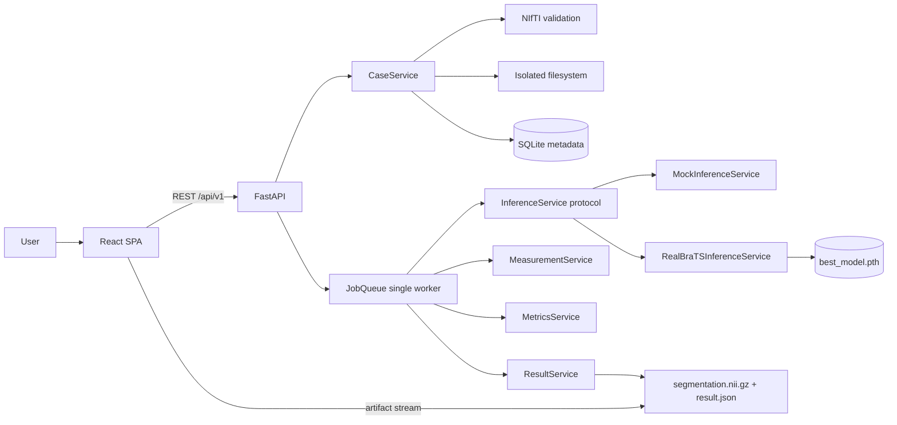

# Architecture — Phase 6

Research / decision-support prototype. **Not a diagnostic device. Not clinically validated.**

## Boundary

Training stays in a separate notebook. This application validates and stores BraTS
NIfTI cases, runs them through a replaceable inference service, extracts quantitative
measurements, evaluates accuracy against ground truth, and visualizes the
result.

Two implementations sit behind that boundary, selected by `INFERENCE_BACKEND`:
`MockInferenceService` (synthetic geometric mask, no checkpoint) and
`RealBraTSInferenceService` (the trained 3D U-Net from the notebook). See
[docs/Phase6_Real_Inference.md](docs/Phase6_Real_Inference.md) for the
notebook→production parity table and the configuration reference.



The frontend never learns which implementation ran. It sees `inference_source`
(`mock`, `pytorch`, or `unavailable`) and an artifact URL. No frontend file
changed in Phase 6.

## Public API

Ingest endpoints create a case, validate it, enqueue a job, and return **202**:

- `POST /api/v1/predict` — four modalities
- `POST /api/v1/evaluate` — four modalities plus `seg` (Dice/HD95 computed post-inference)

Upload UX needs per-file progress, so these case endpoints are **additive**
(not a competing product API):

- `POST /api/v1/cases`
- `POST /api/v1/cases/{case_id}/files/{modality}`
- `POST /api/v1/cases/{case_id}/complete`
- `GET  /api/v1/cases/{case_id}`
- `POST /api/v1/cases/{case_id}/predict` — 202, or 409 if the case is not READY
- `GET  /api/v1/cases/{case_id}/artifacts/{artifact}` — streams an allowlisted NIfTI

Job, result, and report endpoints:

- `GET /api/v1/jobs/{job_id}` — status, progress, `result_id` when COMPLETED
- `GET /api/v1/results/{result_id}` — measurements, evaluation, segmentation availability
- `GET /api/v1/results/{result_id}/measurements` — granular tumor volumes and bounding boxes
- `GET /api/v1/results/{result_id}/report` — diagnostic report summary payload

## Inference boundary

`backend/app/inference/base.py` defines the `InferenceService` protocol and the
`InferenceResult` dataclass. `app/inference/factory.py` maps `INFERENCE_BACKEND`
to an implementation and is the single construction site, called from
`main.py`'s lifespan. PyTorch is imported only on the `pytorch` path, so mock
mode runs on a host with no torch installed.

`RealBraTSInferenceService` loads its checkpoint once at startup and every job
reuses that in-memory model. If the checkpoint is missing, corrupt, or
architecturally incompatible, startup still succeeds but installs
`UnavailableInferenceService`: `/health` reports `model_loaded: false` and
`inference_source: "unavailable"`, and the ingest endpoints return
**503 `MODEL_UNAVAILABLE`** rather than accepting doomed jobs or silently
falling back to synthetic output.

Execution runs through `JobQueue`: an in-process asyncio FIFO with a **single**
worker, so two cases can never contend for the same GPU. Phase 6 added no
parallelism — real inference runs in a thread executor off the event loop,
strictly one case at a time. Documented limits: the
queue is process-local (it does not coordinate across replicas), queued items are
lost on crash while the DB row stays QUEUED/RUNNING, and there is no retry.

## Frontend (`frontend/`)

- **React + TypeScript + Vite**, Tailwind CSS, strict mode.
- **API client**: every request goes through `src/lib/api.ts`, which resolves its
  origin from `VITE_API_URL` (empty = same-origin / Vite proxy). No component
  hardcodes a host.
- **State**: React local state for UI transitions; URL parameters drive case/job lookup.

**Phase 4 visualization** — entirely in-browser, with no PACS/Orthanc dependency:

- **Parsing**: `nifti-reader-js` + `pako` decode `.nii.gz` artifacts into Float32
  arrays, preserving affine and spacing.
- **2D multiplanar slicing**: `src/lib/sliceExtraction.ts` extracts arbitrary
  axial/coronal/sagittal slices from the flat array, applies percentile window
  normalization, and composites the overlay into an `ImageData` for canvas.
- **Coordinate convention**: NIfTI **RAS+** assumed across all axes. No reorientation,
  no resampling.
- **3D mesh generation**: dependency-free marching cubes in `src/lib/meshGeneration.ts`,
  scaling vertices by voxel spacing, with a per-region triangle budget.
- **3D rendering**: `Three.js` via `react-three-fiber`, with `OrbitControls` for
  rotate / zoom / pan.
- **Keyboard**: `KeyJ` / `KeyL` step the active plane, `KeyI` / `KeyK` cycle planes
  (`src/hooks/useSliceKeyboard.ts`).

## Case states

`CREATED` → `UPLOADING` → `VALIDATING` → `READY` or `FAILED`

## Job states

`QUEUED` → `RUNNING` → `COMPLETED` or `FAILED`

Transitions are explicit in `JobService`; there are no ad-hoc booleans.

## Storage

```text
{UPLOAD_DIR}/cases/{case-uuid}/input/{modality}.nii[.gz]
{UPLOAD_DIR}/cases/{case-uuid}/output/segmentation.nii.gz
{UPLOAD_DIR}/cases/{case-uuid}/output/result.json
{UPLOAD_DIR}/cases/{case-uuid}/metadata/case.json
```

Original filenames are never used as filesystem paths. Files are not served by the
frontend origin. Artifact URLs accept only the keys in `VIEWER_ARTIFACTS`; anything
else is a 400 before any path is constructed, so the route cannot be walked.

## Validation

**Hard failure:** unreadable NIfTI, not 3D, non-finite affine/spacing/voxels, missing
required modality, duplicate modality, shape/affine/spacing mismatch, `seg` labels
outside `{0,1,2,4}`, case over `MAX_UPLOAD_SIZE_MB`.

**Warning only:** all-zero volume; qform/sform disagreement.

No resampling. Label `3` is not rewritten to `4` on upload.

## BraTS label semantics

Uploads carry raw BraTS labels `{0, 1, 2, 4}`. The mock generates internally with
`3` for ET and converts once, in `to_brats_labels()` in `app/core/constants.py`,
before anything is written to disk. Every exported artifact and every API response
uses BraTS labels. A real model that emits class `3` must call the same function —
internal class `3` is never displayed as "BraTS label 3".

The frontend keeps the matching display config in `src/types/viewer.ts`
(`REGION_CONFIG`), keyed by BraTS label. Results and viewer read the same table,
so colours cannot drift apart.

## Measurements

Volumes are computed as `voxel_count × sx × sy × sz` from the NIfTI header zooms,
reported in mm³ and cm³ alongside the raw voxel count. Voxel counts are never
presented as physical volume.
