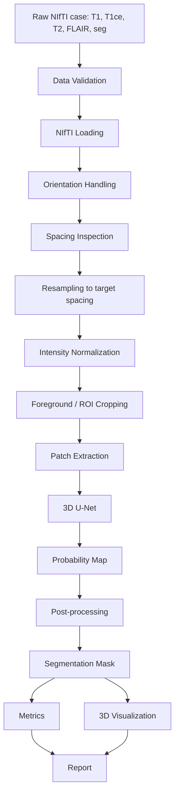
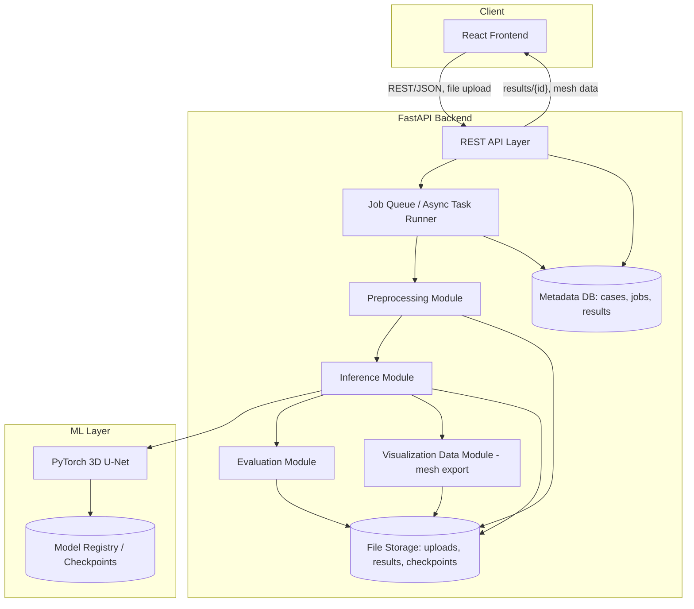
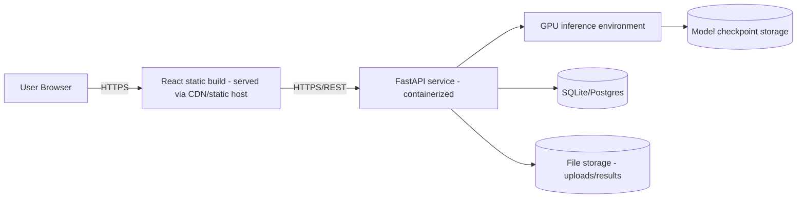
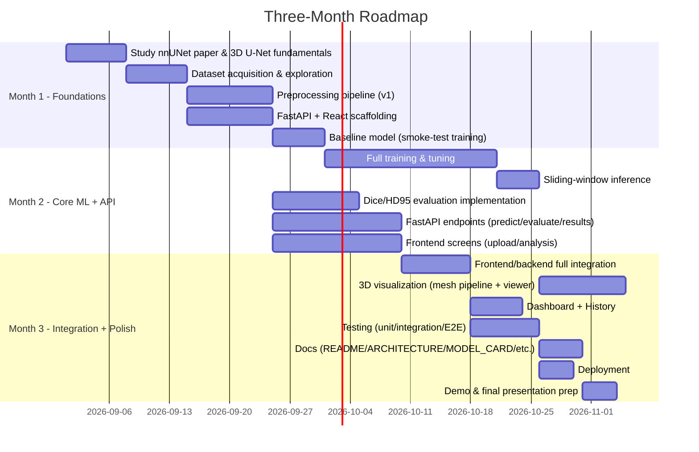

# PRD — Medical Image Segmentation: Tumor Detection

**Document status:** Draft v1.0 — implementation-ready
**Track:** Multimodal AI (Computer Vision)
**Grounding paper:** Isensee et al., "nnU-Net: a self-configuring method for deep learning-based biomedical image segmentation," *Nature Methods*, 2021
**Dataset:** BraTS (Brain Tumor Segmentation Challenge)
**Positioning:** Research / decision-support prototype. **Not a diagnostic device. Not clinically validated.**

Legend used throughout this document:
- **[REQUIREMENT]** — a mandatory, testable statement of what must be built.
- **[RECOMMENDATION]** — the suggested engineering choice, with rationale; deviating from it is acceptable if the rationale no longer applies.
- **[ASSUMPTION]** — something we are treating as true absent evidence to the contrary; if wrong, downstream sections must be revisited.
- **[DEPENDENCY]** — something outside this document's control that this plan relies on.
- **[OPEN QUESTION]** — unresolved, needs an explicit decision before or during implementation.
- **> VERIFY:** — a fact that varies by BraTS release, hardware, or environment and must be confirmed against the actual artifact in hand before it is relied upon. Nothing marked VERIFY should be hardcoded from this document without checking it first.

---

## 1. Executive Summary

This project builds a 3D deep-learning pipeline that segments brain tumor sub-regions from multi-modal MRI volumes (BraTS dataset), wraps it in a FastAPI inference/evaluation service, and exposes it through a React dashboard with 3D visualization. The model architecture is a custom 3D U-Net whose preprocessing, training, and evaluation methodology is **conceptually grounded in nnU-Net** — the project adopts nnU-Net's *ideas* (dataset fingerprinting, resampling/normalization strategy, patch-based training, compound loss, sliding-window inference, connected-component post-processing) without reimplementing or depending on the official nnU-Net framework as a library.

The deliverable is a demonstrable, reproducible, end-to-end system: upload a scan → run inference → view the 3D segmentation → read Dice/Hausdorff metrics → view a results dashboard. It is explicitly scoped as a **three-month capstone/academic project**, not a production clinical system, and every clinical-sounding claim in this document is deliberately hedged accordingly.

## 2. Product Vision

A researcher, student, or clinician-in-training should be able to drop a BraTS-format brain MRI case into a web app and, within seconds to a few minutes, see a 3D rendering of the predicted tumor sub-regions overlaid on the anatomy, alongside transparent, correctly-computed Dice and Hausdorff95 metrics against ground truth (when available), a volume estimate, and a plain-language explanation of what the model can and cannot be trusted to do. The product's value is **transparency and reproducibility of a segmentation research pipeline**, not clinical decision-making authority.

## 3. Problem Statement

Manual delineation of tumor sub-regions (necrotic core, edema, enhancing tumor) in multi-modal MRI is slow, inter-observer variable, and a bottleneck in both clinical workflow and research. This project builds and demonstrates a 3D CNN segmentation model — inspired by the self-configuring principles of nnU-Net — trained on the BraTS dataset, evaluated with the field-standard metrics (Dice, Hausdorff95), and delivered through a usable full-stack application so the result is inspectable, not just a notebook metric.

## 4. Goals and Success Criteria

| # | Goal | Success Criterion |
|---|------|--------------------|
| G1 | Train a 3D tumor segmentation model | Model trains to convergence on the BraTS training split and produces non-degenerate masks (not all-background) on held-out cases |
| G2 | Correct preprocessing | Pipeline reproducibly maps raw NIfTI → normalized, resampled tensors with documented, versioned parameters |
| G3 | Correct inference | Given a valid 4-modality case, the system returns a segmentation mask in the original patient space |
| G4 | 3D visualization | User can rotate/zoom/pan a 3D rendering of the tumor sub-regions and toggle overlay visibility |
| G5 | Quantitative reporting | Dice and Hausdorff95 are computed per-class and reported with the evaluation split, case count, and checkpoint ID |
| G6 | FastAPI service | `/predict` and `/evaluate` endpoints work against the trained model with documented request/response contracts |
| G7 | React frontend | Upload → analyze → results flow works end-to-end in a browser |
| G8 | Dashboard | Aggregate metrics and case history are visualized meaningfully (no decorative charts) |
| G9 | Reproducibility | A second person can retrain/re-evaluate from config files and a README without asking the original author questions |
| G10 | Demonstrability | The full pipeline runs live in a 5–10 minute demo without manual patching |

**Non-clinical caveat (applies globally):** All of the above are *research and engineering* success criteria. None of them constitute evidence of clinical efficacy, diagnostic accuracy in a clinical population, or regulatory-grade validation.

## 5. Non-Goals

- **[REQUIREMENT]** This project will NOT claim to diagnose cancer, stage tumors clinically, or replace radiologist review.
- **[REQUIREMENT]** This project will NOT implement or claim HIPAA/GDPR compliance, multi-tenant clinical-grade security, or PHI-safe hosting.
- **[REQUIREMENT]** This project will NOT support arbitrary imaging modalities beyond the BraTS-defined MRI sequences (T1, T1ce, T2, FLAIR) in MVP.
- **[REQUIREMENT]** This project will NOT reimplement the full official nnU-Net auto-configuration framework (see §11 for the explicit build-vs-adopt decision).
- **[REQUIREMENT]** This project will NOT support real-time/streaming inference, multi-GPU distributed training, or a production autoscaling deployment in MVP.
- **[REQUIREMENT]** Growth/longitudinal tracking (stretch goal) will NOT be presented as a clinical progression assessment tool (see §43).

## 6. Users and Personas

| Persona | Type | Primary need | What they should NOT infer from the tool |
|---|---|---|---|
| Radiologist (reviewer) | Primary | Fast visual localization of candidate tumor sub-regions to speed up manual review | That the mask is diagnostic truth or needs no verification |
| Oncologist | Primary | Tumor volume and rough sub-region breakdown to support discussion, not decision | That volume changes across scans equal validated disease progression |
| Medical AI researcher | Secondary | Reproducible Dice/HD95 numbers, checkpoint provenance, ability to re-run evaluation | N/A — this user is expected to be metric-literate |
| ML engineer / student evaluator | Secondary | Clear architecture, working API, test coverage, demo-ability | N/A |
| Healthcare technology team | Secondary | Understanding of what would be needed to move this toward a real product (see §22, §43) | That current security posture is deployment-ready |

**[REQUIREMENT]** Every screen that shows a segmentation result must carry a visible non-clinical-use disclaimer (see §20.1, §22).

## 7. User Journeys

### 7.1 Radiologist
```text
Open app → read disclaimer → upload/select a 4-modality case
   → system validates + preprocesses → runs inference (async job)
   → view case in 2D slice viewer (axial/coronal/sagittal)
   → view 3D tumor mesh, toggle sub-region visibility, rotate/zoom
   → inspect per-class Dice/HD95 (if ground truth available)
   → export/screenshot result for discussion
```

### 7.2 Oncologist
```text
Open app → select prior processed case(s) from history
   → view tumor volume (mm³ / cm³) broken down by sub-region
   → (stretch) compare volume across two time points for the same patient
   → read explicit caveat that this is not a validated progression metric
```

### 7.3 Researcher / ML Engineer
```text
Open app or call API directly → GET /model/info to confirm checkpoint + training config
   → POST /evaluate against a labeled split → receive per-case + aggregate Dice/HD95
   → cross-check against config files and dataset version in the response
   → reproduce the run locally from configs/ + README
```

## 8. Product Scope

In scope: single-patient, single-timepoint (MVP) BraTS-format 4-modality MRI segmentation into background + up to 3 tumor sub-regions; batch evaluation against a labeled split; 3D + 2D visualization; a metrics dashboard; a documented, config-driven, reproducible training/inference pipeline.

Out of scope (see §5, §9): multi-institution data harmonization, non-BraTS modalities (e.g., raw DICOM from arbitrary scanners) in MVP, clinical workflow integration (PACS/EHR), multi-user production auth beyond basic sessions, regulatory submission artifacts.

## 9. MVP / V1 / Stretch Scope

**[REQUIREMENT] Priority ordering governing every scope trade-off in this project:**

```text
Correct segmentation > Correct evaluation > Reliable inference >
3D visualization > Full-stack integration > Dashboard polish > Stretch features
```

### MVP (must ship in 3 months)
- Preprocessing pipeline (§13) for BraTS-format cases
- Trained custom 3D U-Net (§14) on the official BraTS training split
- Sliding-window inference producing a mask in original patient space
- Dice + HD95 computed correctly per-class and in aggregate (§16)
- FastAPI with `/health`, `/model/info`, `/predict`, `/evaluate`, `/results/{id}` (§26)
- React app: landing/disclaimer, upload, analysis workspace with 2D slice viewer + 3D tumor mesh viewer, results screen
- README + architecture doc + model card
- Basic automated tests for preprocessing, metrics, and one API integration path

### V1 (post-MVP, if time remains)
- Case history screen with persisted past results
- Polished dashboard with aggregate charts (Dice distribution, HD95 distribution, inference time)
- Basic auth/session handling
- Expanded test coverage (integration + ML determinism tests)
- Tumor volume estimation (mm³/cm³) surfaced in UI

### Stretch (only if MVP + V1 are stable)
- Growth-tracking scaffold across multiple timepoints for the same (synthetic/demo) patient (§43)
- Model versioning UI (compare two checkpoints)
- Confidence/uncertainty visualization

## 10. Functional Requirements

See the full requirements table in §34 (Requirements Traceability) for IDs, priorities, and acceptance-criteria cross-references. Summary of functional areas:

- **FR-Data:** ingest, validate, and preprocess a 4-modality BraTS case
- **FR-Model:** run 3D inference and produce a segmentation mask
- **FR-Eval:** compute Dice/HD95 against ground truth when present
- **FR-Viz:** render 2D slices and a 3D tumor mesh with interactive controls
- **FR-API:** expose all of the above over documented REST endpoints
- **FR-UI:** provide upload, analysis, and results screens
- **FR-Report:** produce a structured, versioned evaluation report

## 11. ML Requirements

### 11.1 Build-vs-adopt decision: custom 3D U-Net vs. official nnU-Net

| Option | Description |
|---|---|
| A | Custom 3D U-Net implementation, inspired by nnU-Net concepts |
| B | Use the official nnU-Net framework directly |
| C | Hybrid: official nnU-Net for preprocessing/experiment planning, custom model/training loop |

**[RECOMMENDATION] Adopt Option A — a custom 3D U-Net, conceptually grounded in nnU-Net — as the primary implementation**, for the following reasons:

1. **Learning objectives.** The course's stated core learning goal is "3D U-Net theory & implementation." Delegating training to the official nnU-Net framework (Option B) would satisfy the deliverable but not the learning goal — the team would not implement the architecture, loss, or training loop themselves.
2. **Timeline.** The official nnU-Net framework has its own experiment-planning, environment, and folder-structure conventions (`nnUNet_raw`, `nnUNet_preprocessed`, `nnUNet_results`) and a non-trivial setup/learning curve of its own; a 3-month project that also has to build a full-stack app around it does not have slack to debug someone else's framework internals under time pressure.
3. **Evaluation requirements.** The grading criteria (Dice, HD95, official split, a trained model, an API) are architecture-agnostic — they do not require the official framework, only correct methodology, which can be adopted conceptually.
4. **Reproducibility.** A custom, from-scratch, config-driven pipeline is easier for a small team to fully understand, debug, and reproduce end-to-end than a large third-party framework integrated as a dependency.
5. **Demo quality.** A custom pipeline gives full control over inference latency, output format, and integration with the FastAPI service — necessary for a smooth, fast, live demo.

**Option C (full hybrid) is explicitly not recommended for MVP** because pulling in nnU-Net's automated preprocessing/experiment-planning code as a dependency while writing a separate model/training loop creates two sources of truth for preprocessing parameters, which risks a train/inference mismatch. **[OPEN QUESTION]** If, at V1, the team wants a stronger segmentation baseline for its own sake (not for the demo), running the official nnU-Net framework in parallel as an *offline reference benchmark* (not integrated into the app) is a reasonable enhancement — this is a V1/stretch idea, not MVP.

### 11.2 nnU-Net concepts adopted vs. not adopted

| Concept | Adopted in this project? | How |
|---|---|---|
| Dataset fingerprinting (spacing/intensity stats) | Adopted (lightweight, manual) | Compute per-modality intensity percentiles and median voxel spacing once, store in `configs/dataset_fingerprint.yaml`, reuse at train + inference time |
| Resampling to a target spacing | Adopted | Resample all modalities to a single fixed spacing (see §13) |
| Z-score intensity normalization per modality, foreground-only | Adopted | Per nnU-Net's MRI normalization strategy |
| Patch-based training with foreground oversampling | Adopted | Random 3D patch sampling biased toward tumor-containing patches |
| U-Net encoder/decoder with skip connections | Adopted | Custom implementation (§14) |
| InstanceNorm for 3D medical volumes | Adopted | See §14.3 |
| Deep supervision at multiple decoder resolutions | Adopted (configurable) | Optional auxiliary losses at 2–3 decoder scales |
| Compound Dice + Cross-Entropy loss | Adopted | See §15.2 |
| Sliding-window inference with Gaussian-weighted stitching | Adopted | See §17 |
| Connected-component post-processing | Adopted | Remove small spurious components below a configurable voxel threshold |
| Automatic architecture/config selection ("self-configuring" search over 2D/3D/cascade configs) | **Not adopted** | Out of scope — a single, manually-chosen 3D configuration is used |
| Official nnU-Net codebase/CLI | **Not adopted** | See §11.1 |
| Full 5-fold cross-validation ensembling as used in nnU-Net's official benchmarks | **Not required for MVP**, may be a V1 enhancement if compute allows | |

## 12. Dataset Requirements

**[DEPENDENCY]** The exact BraTS release (e.g., an "adult glioma" segmentation task from a specific year's edition, distributed via a specific host such as the Synapse platform or a Kaggle mirror) is not fixed by this document.

> **VERIFY:** Confirm the exact BraTS release, host, license terms, and download mechanism before implementation. Do not assume a specific year's file naming, label scheme, or case count without checking the actual downloaded data.

### 12.1 What is stable across BraTS releases **[ASSUMPTION, to be confirmed]**
- Four MRI modalities per case: native T1, post-contrast T1 (T1ce/T1Gd), T2, and T2-FLAIR, provided as separate co-registered, skull-stripped NIfTI (`.nii.gz`) volumes.
- A voxel-wise segmentation label map with a small number of tumor sub-region classes plus background.
- Data is already skull-stripped and co-registered to a common anatomical template across modalities for a given case (this is a long-standing BraTS convention but must still be verified for the exact release used).

### 12.2 What varies and MUST be verified before hardcoding anything
> **VERIFY:** exact label integer values and their clinical meaning (label schemes have differed across BraTS editions — do not assume label `1`/`2`/`4` without checking the release's documentation).
> **VERIFY:** exact filename conventions (per-case folder structure, modality suffixes, presence/absence of a segmentation file for the official test set).
> **VERIFY:** official train/validation/test split definition and whether test-set ground truth is publicly released at all (historically it often is not, which affects §16's evaluation split design).
> **VERIFY:** total case count, and whether the distribution includes multiple tumor types (e.g., glioma vs. meningioma vs. pediatric) in a single combined release or as separate tracks.
> **VERIFY:** dataset license and redistribution terms before including any sample data in a public repository or demo.

### 12.3 Dataset requirements (non-version-dependent)

| Requirement | Detail |
|---|---|
| **[REQUIREMENT]** Patient-level split integrity | No single patient/case may appear in more than one of train/val/test. Split at the case-ID level before any patch extraction. |
| **[REQUIREMENT]** Prefer the official split | If BraTS publishes an official train/validation/test partition, use it as the primary evaluation split so reported numbers are comparable to the literature. If official test labels are not public, use the official validation split as the held-out evaluation set and clearly label it as such in every report. |
| **[REQUIREMENT]** Missing/corrupt file handling | The data-loading layer must detect and skip (with a logged warning) any case missing a required modality or with a NIfTI file that fails to load, rather than crashing the run. |
| **[REQUIREMENT]** Class imbalance handling | Background voxels vastly outnumber tumor voxels; this must be addressed via the loss function (§15) and foreground-oversampled patch sampling (§13.7), not ignored. |
| **[REQUIREMENT]** Dataset versioning | Record the dataset release identifier, download date, and a checksum/manifest of case IDs used, in `configs/dataset.yaml`, so a given trained checkpoint can be traced back to the exact data it was trained on. |
| **[RECOMMENDATION]** Augmentation | See §16 (Data Augmentation is actually specified in §15.4 per the requested outline — cross-referenced there). |

## 13. Preprocessing Pipeline



For each stage: input, output, purpose, implementation, failure modes, validation checks.

| Stage | Input | Output | Purpose | Implementation approach | Failure modes | Validation checks |
|---|---|---|---|---|---|---|
| **Data validation** | Raw case folder | Pass/fail + reasons | Reject unusable cases before they reach the model | Check all 4 modality files exist, are readable NIfTI, and share shape/affine | Missing modality; unreadable file; shape mismatch across modalities | Assert 4 modalities present; assert consistent shape+affine; log & skip on failure |
| **NIfTI loading** | `.nii.gz` files | In-memory arrays + affine + header | Get raw voxel data and spatial metadata | `nibabel.load()`, read `.get_fdata()` and `.affine` | Corrupt gzip; unsupported dtype | Try/except around load; verify non-empty array; verify 3D shape |
| **Orientation handling** | Arrays + affine | Canonically-oriented arrays (e.g., RAS+) | Ensure all cases/modalities share one anatomical orientation convention | `nibabel.as_closest_canonical()` or explicit affine-based reorientation | Inconsistent orientation across cases silently corrupts spatial alignment | Compare orientation codes pre/post; assert all modalities reoriented identically |
| **Spacing inspection** | Canonical arrays + affine | Voxel spacing tuple (mm) | Determine if resampling is needed and by how much | Extract spacing from affine via `nibabel`/SimpleITK | Non-isotropic or per-case-varying spacing | Log spacing distribution across dataset at fingerprinting time |
| **Resampling** | Arrays at native spacing | Arrays at target spacing | Normalize physical voxel size across cases so the network sees consistent scale | SimpleITK `Resample` with linear interpolation for images, nearest-neighbor for label maps | Wrong interpolation on labels creates non-integer "fractional" classes | Assert resampled label map contains only the original label set (set-equality check) |
| **Intensity normalization** | Resampled image | Z-scored image, per modality | Standardize intensity distributions across scanners/sites (MRI has no fixed intensity units, unlike CT/Hounsfield units) | Per-modality, foreground-only z-score: subtract mean/divide by std computed over non-zero (brain-tissue) voxels | Normalizing over the zero-padded background biases the distribution | Compute stats only within a brain mask (non-zero region); clip extreme outlier percentiles per §13.5 |
| **Foreground/ROI processing** | Normalized volume | Cropped volume | Remove empty background bounding-box margin to save memory/compute | Compute bounding box of non-zero voxels across modalities; crop with a small margin | Over-tight crop clips true tumor tissue at the border | Assert crop bounding box has non-zero margin; validate against ground-truth mask bounding box during dataset QA |
| **Patch extraction** | Cropped volume | Fixed-size 3D patches | Fit training into GPU memory; oversample rare foreground | Random patch sampling, with a configurable fraction of patches forced to contain foreground (see §13.7) | All-background patches dominate training if not oversampled | Track foreground-voxel fraction per sampled patch in logs during initial pipeline QA |
| **Inference (whole-volume)** | Preprocessed volume | Patch-wise predictions | Predict on volumes larger than a training patch | Sliding-window inference with overlap + Gaussian weighting (§17) | Seams/discontinuities at patch borders | Visual QA of stitched output for seam artifacts |
| **Post-processing** | Raw probability map | Cleaned mask | Remove implausible spurious predictions | Argmax → connected-component filtering, remove components under a voxel-count threshold | Over-aggressive filtering removes small true-positive lesions | Compare pre/post Dice on validation set; threshold chosen to not reduce Dice |
| **Mask export** | Cleaned mask (in resampled space) | Mask resampled back to original patient space | Deliver a result in the coordinate space the user uploaded | Nearest-neighbor resample back to original affine/shape; save as `.nii.gz` | Losing the original affine breaks downstream visualization alignment | Assert output shape/affine matches original input exactly |

### 13.1 Input format
**[REQUIREMENT]** Input is a per-case set of four co-registered, skull-stripped MRI NIfTI volumes: **T1, T1ce (post-contrast), T2, FLAIR**. `.nii` or `.nii.gz` accepted.

### 13.2 Expected modalities
**[REQUIREMENT]** Exactly 4 channels, in a fixed, documented order (e.g., `[T1, T1ce, T2, FLAIR]`), stacked as the network's input channel dimension. > **VERIFY** the exact modality-order convention used by whichever BraTS release is adopted, and keep it identical across preprocessing, training, and the API's upload validation.

### 13.3 Tensor shapes
**[RECOMMENDATION]** Network input tensor: `(N, 4, D, H, W)` with a fixed training patch size such as `(128, 128, 128)` **[ASSUMPTION — configurable; tune to available GPU memory, see §15]**. Output tensor: `(N, C, D, H, W)` where `C` = number of classes (background + tumor sub-regions).

### 13.4 Normalization
Per §13 table: per-modality, foreground-only z-score normalization. **[RECOMMENDATION]** Clip intensities to the [0.5, 99.5] percentile range (computed at dataset-fingerprinting time, per modality) before z-scoring, to reduce the influence of extreme outlier voxels (e.g., imaging artifacts).

### 13.5 Resampling
**[RECOMMENDATION]** Resample every case to a single fixed isotropic-or-near-isotropic target spacing derived from the dataset fingerprint (e.g., the median spacing across the training set — nnU-Net-style). > **VERIFY** the native spacing distribution of the actual BraTS release in use; many recent BraTS releases already distribute data at a common 1mm³ isotropic spacing, in which case resampling may be a no-op validation step rather than an active transform — do not assume this without checking.

### 13.6 Cropping/padding
Crop to the non-zero foreground bounding box (§13 table) with a fixed margin (e.g., 10 voxels **[ASSUMPTION]**); pad with zeros if a sampled patch would exceed the cropped volume's extent.

### 13.7 Patch-based inference
**[REQUIREMENT]** Training uses random patch sampling with a configurable foreground-oversampling ratio (**[RECOMMENDATION]** ≥ 1/3 of sampled patches guaranteed to contain at least one foreground voxel, nnU-Net-style). Full-volume inference uses sliding-window patch inference (§17), not single-patch inference, since evaluation volumes are larger than the training patch size.

### 13.8 Post-processing
Argmax over class probabilities → 3D connected-component analysis per foreground class → remove components below a configurable minimum voxel count → optionally keep only the largest connected component per class if empirically justified by validation Dice (do not apply this by default without checking it does not remove true small lesions).

### 13.9 Output format
**[REQUIREMENT]** Output is a single-channel integer label-map NIfTI (`.nii.gz`), same shape/affine as the original input, with the same label scheme as the training labels (documented in `MODEL_CARD.md`).

## 14. Model Architecture

### 14.1 Overview
A custom 3D U-Net: symmetric encoder–decoder with skip connections, operating on the 4-channel input volume described in §13.

```mermaid
graph LR
    subgraph Encoder
    I[Input 4xDxHxW] --> E1[Conv Block 1]
    E1 --> D1[Downsample]
    D1 --> E2[Conv Block 2]
    E2 --> D2[Downsample]
    D2 --> E3[Conv Block 3]
    E3 --> D3[Downsample]
    D3 --> E4[Conv Block 4 - Bottleneck]
    end
    subgraph Decoder
    E4 --> U3[Upsample]
    U3 --> C3[Concat w/ E3]
    C3 --> DB3[Conv Block]
    DB3 --> U2[Upsample]
    U2 --> C2[Concat w/ E2]
    C2 --> DB2[Conv Block]
    DB2 --> U1[Upsample]
    U1 --> C1[Concat w/ E1]
    C1 --> DB1[Conv Block]
    DB1 --> O[Output CxDxHxW]
    end
```



### 14.2 Component specification

| Component | Specification |
|---|---|
| Encoder | 4–5 stages **[ASSUMPTION, tune to GPU memory]**; each stage = two 3×3×3 conv blocks followed by strided-conv (or max-pool) downsampling by 2× |
| Decoder | Mirrors encoder depth; transposed-conv (or trilinear upsample + conv) upsampling by 2×, concatenation with the corresponding encoder skip connection, then two 3×3×3 conv blocks |
| Skip connections | Channel-wise concatenation (not addition), U-Net-style, at every resolution level |
| Convolution blocks | `Conv3d → Norm → Activation`, repeated twice per stage |
| Activation | LeakyReLU (negative slope ≈ 0.01) **[RECOMMENDATION]**, matching common 3D-medical-U-Net practice; plain ReLU is an acceptable, simpler fallback |
| Downsampling | Strided convolution (stride 2) **[RECOMMENDATION]**, preferred over max-pooling for slightly better gradient flow; max-pooling is an acceptable simpler alternative |
| Upsampling | Trilinear interpolation + 1×1×1 conv, or transposed convolution — either is acceptable; document whichever is chosen |
| Channels | Starting width e.g. 16 or 32 at the first stage **[ASSUMPTION — configurable]**, doubling at each downsampling stage, capped at a maximum (e.g., 320 **[ASSUMPTION]**) to bound GPU memory |
| Input dimensions | `(4, D, H, W)` per §13.3 |
| Output dimensions | `(C, D, H, W)`, `C` = number of classes |
| Number of classes | Background + tumor sub-regions. > **VERIFY** the exact number/definition of sub-region classes for the BraTS release in use (historically 3 foreground classes are common, but do not hardcode without checking) |
| Parameter count | Report actual parameter count once architecture is finalized; keep it a *configurable* function of channel width and depth rather than a fixed, hand-tuned number |
| GPU memory constraints | Patch size, batch size, and channel width are the three levers to reduce memory pressure; mixed precision (§15) is the fourth |
| Deep supervision (optional) | Auxiliary segmentation heads at 2–3 lower-resolution decoder stages, each with its own loss term, downweighted relative to the full-resolution output — nnU-Net-inspired, **optional for MVP**, can be added if training is unstable without it |

### 14.3 Normalization choice: BatchNorm vs InstanceNorm vs GroupNorm

**[RECOMMENDATION] Use InstanceNorm3d.** Rationale: 3D volumetric training typically uses very small batch sizes (often 1–4 patches per GPU, due to memory constraints), at which BatchNorm's running statistics become unreliable (batch statistics are noisy with so few samples, and normalization can vary significantly at inference vs. training time). InstanceNorm computes statistics per-sample, per-channel, independent of batch size, which is exactly why it is the standard choice for nnU-Net-style 3D medical segmentation. GroupNorm is a reasonable alternative (batch-independent, generally between BatchNorm and InstanceNorm in behavior) and can be tried as an ablation, but InstanceNorm is the recommended default.

## 15. Training Strategy

### 15.1 Overview table

| Parameter | Starting value (configurable) | Notes |
|---|---|---|
| Optimizer | SGD with Nesterov momentum (momentum ≈ 0.99) or Adam/AdamW | **[RECOMMENDATION]** SGD+Nesterov (nnU-Net's default) tends to generalize well for this task but requires more careful LR scheduling; AdamW is an easier-to-tune fallback if training is unstable |
| Learning rate | ≈ 1e-2 for SGD, or ≈ 1e-4 for AdamW | **[ASSUMPTION — not universally optimal; treat as a tunable hyperparameter]** |
| Scheduler | Polynomial LR decay (`lr * (1 - epoch/max_epoch)^0.9`) | nnU-Net-style; cosine annealing is an acceptable alternative |
| Batch size | 1–4 patches (per §14.3's memory reasoning) | Tune to available GPU memory |
| Epochs | Defined as N training steps per "epoch" (not one full dataset pass, since patches are randomly sampled) — e.g., 250 steps/epoch × up to ~250–1000 epochs **[ASSUMPTION]** | Actual value depends on compute budget; use early stopping / checkpoint-on-best-val-Dice rather than a fixed count as the real stopping criterion |
| Mixed precision | Enabled (`torch.cuda.amp`) | Reduces memory footprint, allows larger patch/batch size |
| Gradient accumulation | Optional, only if the desired effective batch size exceeds what fits in memory | |
| Checkpointing | Save best-Dice-so-far checkpoint + latest checkpoint every N validation rounds | Enables resuming and rollback |
| Early stopping | Stop if validation Dice does not improve for a configurable patience window (e.g., 50 validation rounds) **[ASSUMPTION]** | |
| Validation frequency | Every fixed number of training steps (e.g., every epoch as defined above) | |
| Random seeds | Fix seeds for Python, NumPy, and PyTorch (CPU + CUDA) at the start of every run; log the seed used | For reproducibility (§33) |
| GPU memory optimization | Mixed precision + patch size + channel width + gradient checkpointing (optional) | See §14 |

### 15.2 Loss function

| Candidate | Verdict |
|---|---|
| Dice Loss alone | Handles class imbalance well but can be unstable/noisy early in training and provides a weak gradient signal for very small or absent foreground regions |
| Cross-Entropy alone | Stable gradients but dominated by the overwhelming background class, so it under-weights small tumor regions |
| **Dice + Cross-Entropy (compound)** | **[RECOMMENDATION] — chosen loss.** Combines CE's stable, well-calibrated per-voxel gradient with Dice's overlap-focused, imbalance-robust signal. This is the loss nnU-Net defaults to and it is well validated for this exact task. |
| Focal Loss | Useful when there is severe *foreground* class imbalance among sub-classes (e.g., enhancing tumor is rare relative to edema); consider as a V1 ablation, not MVP default |
| Tversky Loss | A generalization of Dice with tunable false-positive/false-negative weighting; useful if the model shows a systematic precision/recall imbalance during evaluation, otherwise unnecessary added complexity for MVP |

**Mathematical intuition (implementation-oriented):**

Soft Dice loss per class $c$:
$$
\mathcal{L}_{Dice}^{c} = 1 - \frac{2 \sum_i p_i^c g_i^c + \epsilon}{\sum_i p_i^c + \sum_i g_i^c + \epsilon}
$$
where $p_i^c$ is the predicted probability for voxel $i$/class $c$, $g_i^c$ is the one-hot ground truth, and $\epsilon$ is a small constant preventing division by zero when a class is absent from a patch.

Combined loss:
$$
\mathcal{L} = \mathcal{L}_{CE} + \frac{1}{|C_{fg}|}\sum_{c \in C_{fg}} \mathcal{L}_{Dice}^{c}
$$
computed over foreground classes (background optionally excluded from the Dice term, included in CE), averaged across a training batch.

### 15.3 Reproducibility requirements
**[REQUIREMENT]** Every training run must log: git commit hash, full resolved config (post any CLI overrides), random seed, dataset version identifier, and produce a checkpoint file that embeds these as metadata (see §33).

### 15.4 Data augmentation

| Augmentation | Use? | Rationale |
|---|---|---|
| Random flips (sagittal axis) | **Yes** | Brain anatomy has approximate left-right symmetry; flipping along the correct anatomical axis is a safe, cheap augmentation |
| Random rotation (small angle, e.g. ±15–20°) | **Yes** | Models scanner/patient positioning variance |
| Random scaling (e.g. 0.85–1.25×) | **Yes** | Models head-size variance across patients |
| Elastic deformation | **Use sparingly / optional** | Can improve robustness but is computationally expensive in 3D and risks distorting tumor shape in ways that hurt boundary-sensitive metrics (HD95) if overused; if used, keep deformation magnitude conservative |
| Gaussian noise | **Yes (light)** | Models scanner noise; keep magnitude small relative to normalized intensity range |
| Intensity shift | **Yes (light)** | Models scanner/protocol intensity variability, given MRI has no fixed intensity units |
| Intensity scaling/gamma | **Yes (light)** | Same rationale as intensity shift |
| Random cropping (beyond patch sampling) | **Not a separate augmentation** | Patch sampling (§13.7) already serves this role |
| **Avoid:** flips along the anterior-posterior or superior-inferior axes as if interchangeable with left-right | **No** | Brain anatomy is not symmetric front-to-back or top-to-bottom; such flips would create anatomically invalid training examples |
| **Avoid:** aggressive elastic deformation as a default | **No (or minimal)** | Risk of corrupting fine tumor-boundary shape that HD95 is sensitive to |

## 16. Evaluation Strategy

### 16.1 Dice coefficient

Formula, per class $c$, computed on the final discrete (argmaxed) prediction $P$ against ground truth $G$:
$$
Dice_c = \frac{2 |P_c \cap G_c|}{|P_c| + |G_c|}
$$
**Interpretation:** ranges [0, 1]; 1 = perfect overlap, 0 = no overlap. Unlike voxel accuracy, Dice is robust to the background-class imbalance because it is computed per foreground class, not averaged over all voxels.

**[REQUIREMENT]**
- Report **per-class Dice** for every tumor sub-region class present in the label scheme.
- Report **mean Dice** (macro-average across foreground classes) as the headline number.
- **Aggregation strategy:** compute Dice per case, then average across cases (macro over cases) — **not** a single pooled Dice computed over all voxels of all cases concatenated together, which would let large cases dominate the metric.
- **Edge case:** if a class is absent from ground truth *and* absent from the prediction for a given case, define Dice for that class/case as 1.0 (perfect agreement on absence) and exclude it, or include it as 1.0, consistently — document whichever convention is chosen, and apply it uniformly. If the class is absent from ground truth but present in the prediction (false positive with no true region), Dice is 0 by the formula (denominator > 0, numerator 0) — this is correct behavior and should not be special-cased away.

### 16.2 Hausdorff distance

**HD** (standard Hausdorff distance): the maximum over all surface points in one set of the minimum distance to the nearest surface point in the other set — i.e., the worst-case boundary error. **HD95**: the 95th percentile of that same surface-distance distribution, instead of the maximum.

**[RECOMMENDATION] Report HD95 as the primary Hausdorff-family metric**, for the reason the task explicitly asks to explain: standard HD is dominated by a single worst-case outlier point (e.g., one stray mis-segmented voxel far from the true lesion can make HD enormous even if the rest of the boundary is nearly perfect), which makes it a noisy, unstable metric for model comparison. HD95 discards the top 5% most extreme distances, making it far more robust to isolated segmentation artifacts while still penalizing genuine boundary disagreement — this is why HD95, not raw HD, is the field-standard metric reported in BraTS challenge leaderboards and the broader medical segmentation literature. **[REQUIREMENT]** Report both HD and HD95 if compute allows, but treat HD95 as the number used for model comparison/selection; never silently substitute one for the other without labeling which was computed.

**[REQUIREMENT] Units:** millimeters (mm), computed using the actual voxel spacing (not voxel-index distance), i.e., surface points must be converted to physical coordinates before distance computation.

**[REQUIREMENT] Handling empty predictions/ground truth (edge cases):**
- If both prediction and ground truth are empty for a class/case: define HD95 = 0 (no boundary disagreement possible) and flag the case in logs so it doesn't silently mask an all-background bug.
- If ground truth is empty but the prediction is non-empty (or vice versa): HD is mathematically undefined (no surface points on one side). **[REQUIREMENT]** Do not silently return 0 or drop the case — explicitly flag this case/class combination in the report as "undefined — one of prediction/ground-truth is empty" rather than substituting a numeric placeholder that could be misread as a good score.

**[REQUIREMENT] Per-class and mean values:** report per-class HD95 and a macro-average across foreground classes, analogous to Dice's aggregation in §16.1.

### 16.3 Evaluation split and case-level protocol

**[REQUIREMENT]**
- Evaluate on the **official BraTS split** (§12.3) if ground truth is available for it; if official test-set labels are not public, use the official validation split as the held-out evaluation set, and label every report clearly with which split was used.
- Compute metrics **per patient/case**, then aggregate (mean, and — where practical — standard deviation or a bootstrap confidence interval across cases) rather than reporting only a single pooled number.
- Every evaluation report must include: evaluation split name, number of cases evaluated, model/checkpoint identifier, dataset version, and a timestamp.

## 17. Inference Pipeline

**[REQUIREMENT]** Whole-volume inference uses **sliding-window inference**: the input volume is tiled into overlapping patches matching the training patch size (§13.3), each patch is run through the network, and overlapping predictions are combined using **Gaussian-weighted blending** (higher weight toward patch centers, lower at patch edges) to avoid visible seams at patch boundaries. The final blended probability map is then argmaxed and post-processed (§13.8) before being resampled back to the original patient space and saved (§13.9).

**[RECOMMENDATION]** Default sliding-window overlap: 50% **[ASSUMPTION — tune for latency/quality trade-off]**.

**[REQUIREMENT]** Inference must be deterministic given a fixed checkpoint and fixed input (no test-time augmentation randomness by default in MVP; test-time augmentation/mirroring ensembling is an acceptable V1 quality improvement, but must be flagged in the API response if enabled, since it changes latency).

## 18. 3D Visualization Requirements

### 18.1 Technology evaluation

| Option | Pros | Cons | Verdict |
|---|---|---|---|
| **vtk.js** | Purpose-built for medical volume rendering; supports true volumetric ray-casting, MPR (multi-planar reconstruction) slice views, DICOM-aware utilities | Heavier learning curve; larger bundle; more setup for a 3-month team with a full-stack app to also build | Reserve for **V1/stretch** if full volumetric ray-casting of the raw MRI intensity volume is desired |
| **Three.js (raw)** | Full control, mature ecosystem, lightweight for simple geometry | No built-in medical primitives — you'd hand-roll everything vtk.js gives you | Use only as the underlying engine, not directly — via react-three-fiber |
| **react-three-fiber (Three.js + React bindings)** | Idiomatic React integration (fits the required frontend stack), good performance for mesh rendering, straightforward to render a **surface mesh extracted from the segmentation mask** (marching cubes) plus simple 2D slice textures, large community/examples | Not purpose-built for volumetric ray-casting of the *raw intensity volume* the way vtk.js is | **[RECOMMENDATION] — chosen for MVP** |

**[RECOMMENDATION] — Smallest architecture that is impressive and reliable:**
1. **2D orthogonal slice viewer** (axial/coronal/sagittal) rendered on HTML5 `<canvas>`, showing the selected MRI modality with the segmentation overlaid as a semi-transparent color mask, with a scroll/slider to move through slices. This is the reliable, standard-in-radiology-tools baseline view and is cheap to implement and always correct.
2. **3D tumor surface mesh** extracted from the segmentation mask via **marching cubes** (computed server-side or client-side from the returned mask, e.g., using `scikit-image.measure.marching_cubes` server-side, exporting a lightweight mesh format such as glTF/GLB or a raw vertex/face JSON), rendered in **react-three-fiber** with per-sub-region color, rotate/zoom/pan via `OrbitControls`, and a toggle to show/hide each sub-region layer and the base-brain surface (also extracted via marching cubes on a whole-brain mask, at reduced opacity, for anatomical context).

This deliberately **avoids full volumetric ray-casting of the whole raw MRI intensity volume** in MVP — that is higher implementation cost (favoring vtk.js) and marginal incremental value over "2D slices for detail + 3D mesh for the tumor shape," which already satisfies every UX requirement listed in the brief (rotate, zoom, pan, toggle, distinguish tumor from background, inspect sub-regions).

### 18.2 UX requirements
**[REQUIREMENT]** Users can: select/upload a case; view the base MRI volume as 2D slices in all 3 anatomical planes; view the segmentation as a color overlay on the 2D slices; view a rotatable/zoomable/pannable 3D mesh of the tumor sub-regions; toggle segmentation visibility (2D and 3D); toggle individual sub-region layers in 3D; visually distinguish sub-regions by a consistent, documented color legend.

### 18.3 GPU/browser considerations
**[REQUIREMENT]** Meshes must be simplified/decimated server-side (or capped in vertex count) before sending to the browser, since raw marching-cubes output on a full-resolution volume can produce meshes too large for smooth in-browser rendering. **[RECOMMENDATION]** Target under ~200k triangles per rendered case as a starting budget **[ASSUMPTION — tune based on real profiling]**.

## 19. FastAPI Requirements

See full endpoint specification in §26. Summary of cross-cutting requirements:

**[REQUIREMENT]**
- Async/background execution for inference and evaluation jobs (both are too slow to run synchronously within a single HTTP request in the general case); return a **job ID** immediately, poll or receive the result via a `GET /results/{id}` endpoint.
- CORS configured to allow the deployed frontend origin (and `localhost` origins in development).
- File upload size limits enforced (reject oversized uploads with a clear 4xx error) — a 4-modality 3D MRI case is large; **[ASSUMPTION]** cap at e.g. 500MB per case, tune based on real case sizes once BraTS release is confirmed (§12).
- Structured logging with request IDs and inference/job IDs (§30).
- API versioning via a URL prefix (e.g., `/api/v1/...`) from day one, even though only one version will exist in MVP, so future breaking changes don't require a frontend rewrite.

## 20. React Requirements

### 20.1 Landing / Home
Explains the project's purpose in plain language, an "Upload a case" call to action, a summary of the model (checkpoint version, training dataset, headline Dice/HD95), and a **persistent, prominent non-clinical-use disclaimer** ("This is a research prototype. It is not a medical device and must not be used for diagnosis or treatment decisions.").

### 20.2 Upload / Case Selection
File upload (drag-and-drop + file picker) for the 4 required modality files (or a pre-packaged case archive); client-side validation of file count/extension before upload; upload progress indicator; clear, specific error messages on validation failure (missing modality, wrong file type, oversized file).

### 20.3 Analysis Workspace
2D slice viewer (axial/coronal/sagittal) with modality selector and segmentation-overlay toggle; embedded 3D tumor-mesh viewer (§18); live inference status (queued/running/done/failed) polling the backend job; case metadata panel (case ID, modalities present, upload timestamp).

### 20.4 Results Dashboard
Per-class and mean Dice; per-class and mean HD95; tumor volume (mm³/cm³) per sub-region (once §43's volume estimation is wired in); model/checkpoint version and evaluation split used; the same 3D visualization embedded for convenient side-by-side review with the numbers.

### 20.5 History (if implemented — V1)
List of previously processed cases with timestamp, headline metrics, and model version used at the time; clicking a row reopens that case's Results Dashboard.

## 21. Dashboard Requirements

**[REQUIREMENT]** Every chart must answer a specific question — no decorative visualizations.

| Widget | Question it answers | Chart type |
|---|---|---|
| KPI cards | "What's the headline mean Dice / HD95 / case count right now?" | Numeric cards |
| Dice distribution | "How consistent is segmentation quality across cases?" | Histogram or box plot across evaluated cases |
| Hausdorff95 distribution | Same, for boundary accuracy | Histogram or box plot |
| Per-class metrics table | "Which tumor sub-region is hardest for the model?" | Table (Dice + HD95 per class) |
| Inference time | "Is the system fast enough to be usable?" | Line/bar over recent jobs |
| Tumor volume (per case) | "How large is the segmented tumor, in clinical units?" | Bar per sub-region |
| Case metadata panel | "What exactly am I looking at?" | Simple key-value panel, not a chart |
| Embedded 3D viewer | "What does this actually look like?" | 3D mesh (§18) |

## 22. Security and Privacy

**[REQUIREMENT]**
- No real patient data in development — use only public, de-identified BraTS research data; never introduce any additional real clinical data into this project without institutional review and explicit legal clearance, which is out of scope here.
- Validate every uploaded file's type/structure server-side (never trust client-side validation alone) before it reaches any parsing library, to reduce the risk of malformed-file exploits.
- Enforce upload size limits (§19) at the web-server layer, not only in application code.
- Store uploaded cases and results in a location not publicly web-accessible; generate opaque, non-guessable IDs for cases/results (not sequential integers) to prevent enumeration.
- Basic auth/session handling (V1, §9) gates access to uploaded cases and results so one user's session cannot casually browse another's data by guessing IDs — even in a demo/academic deployment.
- Logs must never contain uploaded file contents, voxel data, or any field that could re-identify a case beyond its internal system-generated ID (§30).
- Provide a data-deletion path (an endpoint or admin script) to remove an uploaded case and its derived results.
- HTTPS required for any non-local deployment; secrets (API keys, session secrets) via environment variables / a secrets manager, never committed to the repository.

**[REQUIREMENT — verbatim disclaimer to carry through the project]:** *This project is an academic/research prototype and is not automatically HIPAA/GDPR compliant merely because these controls exist.* Achieving actual regulatory compliance would require a formal risk assessment, a designated compliance officer, signed data-processing agreements, audited infrastructure, and — for HIPAA specifically — a Business Associate Agreement with any cloud vendor used; none of that is in scope for this project.

## 23. Non-Functional Requirements

| Category | Requirement |
|---|---|
| **Performance — upload** | Client displays upload progress for files of realistic BraTS case size; server streams/chunks large uploads rather than buffering the entire file in memory at once |
| **Performance — inference latency** | **[ASSUMPTION, to be measured]** Target end-to-end inference (preprocessing + sliding-window inference + post-processing) under ~1–2 minutes per case on the target GPU — treat as a measured, reported number in the final report, not a guaranteed SLA |
| **Performance — visualization responsiveness** | 3D viewer maintains interactive frame rates on the decimated mesh (§18.3) on a typical laptop GPU |
| **Reliability** | Every documented error case (§29) returns a structured error response, not a raw 500/stack trace, to the frontend |
| **Reliability — failed inference recovery** | A failed job is marked `failed` with a reason, not left `running` forever; the frontend surfaces this state clearly |
| **Scalability** | MVP targets a single-user/small-class demo load; the async job-queue design (§19, §26) leaves room to add a real task queue (e.g., Celery/RQ) and a GPU work queue in V1 without an API contract change |
| **Scalability — concurrent inference** | If only one GPU is available, concurrent requests are queued (FIFO) rather than attempted in parallel and OOM-crashing |
| **Maintainability** | Modular separation of ML / API / frontend (§24); Python type hints throughout the backend and ML code; docstrings on all public functions; CI-runnable test suite (§28) |
| **Reproducibility** | Fixed seeds, locked dependencies, versioned configs, versioned checkpoints, versioned dataset manifest (§33) |

## 24. System Architecture



**Data flow narrative:**
1. Frontend uploads a case → API validates request shape (not file content yet) and creates a `case` + `job` record in the metadata DB, returns a job ID immediately.
2. Job queue picks up the job asynchronously; preprocessing module validates file content, runs the pipeline in §13, writes intermediate/preprocessed tensors to file storage.
3. Inference module loads the requested (or default/latest) checkpoint from the model registry, runs sliding-window inference (§17), writes the resulting mask to storage, updates job status.
4. If ground truth was provided/available, the evaluation module computes Dice/HD95 (§16) and stores the metrics.
5. The visualization module extracts a 3D mesh (§18) from the mask and stores mesh data alongside the case.
6. Frontend polls/receives `GET /results/{id}`, which returns metrics, mesh reference/data, and case metadata for rendering.

**Component responsibilities:**
- **Frontend:** presentation, user interaction, polling, rendering 2D slices + 3D mesh.
- **Backend (API layer):** request validation, auth (V1), routing, response shaping.
- **Job queue:** decouples slow ML work from the HTTP request/response cycle.
- **Preprocessing/Inference/Evaluation/Visualization modules:** independently testable, independently executable (can be run as CLI scripts outside the API for training/offline evaluation — §11.1's reproducibility rationale).
- **Model registry:** versioned checkpoints with associated config/metadata, so `/model/info` can report exactly what is running.
- **Metadata DB:** case/job/result bookkeeping — **[RECOMMENDATION]** SQLite for MVP (zero-ops, file-based, sufficient for a single-instance academic deployment), with a documented, straightforward upgrade path to PostgreSQL if concurrent multi-user load ever requires it.

## 25. Repository Structure

```text
project-root/
├── backend/                # FastAPI application
│   ├── app/
│   │   ├── api/            # route definitions, versioned (v1/)
│   │   ├── core/           # config loading, logging setup
│   │   ├── models/         # Pydantic request/response schemas
│   │   ├── db/             # DB models + migrations
│   │   ├── services/       # job orchestration, calls into ml/
│   │   └── main.py
│   └── tests/
├── ml/                      # ML pipeline — independently executable, no FastAPI dependency
│   ├── data/                # dataset loading, splitting, fingerprinting
│   ├── preprocessing/       # §13 pipeline stages
│   ├── model/               # 3D U-Net definition (§14)
│   ├── training/            # training loop, loss (§15)
│   ├── inference/           # sliding-window inference (§17)
│   ├── evaluation/          # Dice/HD95 (§16)
│   ├── postprocessing/      # connected-component filtering, mesh export (§18)
│   └── tests/
├── frontend/                # React application
│   ├── src/
│   │   ├── pages/           # Landing, Upload, Analysis, Results, History
│   │   ├── components/      # SliceViewer, MeshViewer3D, Dashboard widgets
│   │   ├── api/             # Axios client
│   │   └── App.tsx
│   └── tests/
├── models/                  # checkpoint artifacts (git-ignored; referenced by manifest, not committed in full)
├── data/                    # local dataset cache (git-ignored)
├── notebooks/               # exploratory analysis only — no pipeline logic should live only in a notebook
├── configs/                 # dataset.yaml, model.yaml, training.yaml, evaluation.yaml, api.yaml, deployment.yaml
├── scripts/                 # CLI entry points: preprocess.py, train.py, evaluate.py, export_checkpoint.py
├── docker/                  # Dockerfiles for backend, frontend, and (optionally) a combined dev compose file
├── docs/                    # ARCHITECTURE.md, DATASET.md, API.md, EVALUATION.md, MODEL_CARD.md
├── tests/                   # end-to-end / integration tests spanning multiple modules
├── README.md
└── PRD.md
```

**Rationale:** `ml/` has zero dependency on `backend/`, so the entire training/evaluation pipeline is runnable and testable as plain Python scripts (`scripts/train.py`, `scripts/evaluate.py`) independent of the web service — directly satisfying "make the model pipeline independently executable." `backend/services/` is the only place that imports both `ml/` and the API layer, keeping the boundary explicit.

## 26. API Specification

**[RECOMMENDATION]** Base path: `/api/v1`. The endpoint set below is a recommendation, not a fixed contract — adjust as implementation reveals better shapes, but keep every change documented in `docs/API.md`.

### 26.1 `GET /api/v1/health`
- **Purpose:** liveness/readiness check.
- **Auth:** none.
- **Response 200:** `{"status": "ok", "model_loaded": true}`

### 26.2 `GET /api/v1/model/info`
- **Purpose:** report the currently loaded checkpoint's identity and provenance.
- **Auth:** none (V1: session-gated).
- **Response 200 example:**
```json
{
  "checkpoint_id": "unet3d-v1-ep180",
  "dataset_version": "brats-<VERIFY-release>-v1",
  "trained_on_split": "official_train",
  "headline_metrics": {"mean_dice": 0.81, "mean_hd95_mm": 4.2},
  "num_classes": 4,
  "input_modalities": ["T1", "T1ce", "T2", "FLAIR"]
}
```

### 26.3 `POST /api/v1/predict`
- **Purpose:** submit a case for segmentation inference.
- **Auth:** none (V1: session-gated).
- **Request:** `multipart/form-data` with 4 named file fields (`t1`, `t1ce`, `t2`, `flair`).
- **Validation:** file count = 4; extensions in `{.nii, .nii.gz}`; each file passes NIfTI header parse.
- **Response 202 (Accepted):** `{"job_id": "job_9f1a...", "status": "queued"}`
- **Errors:** `400` missing/invalid modality (body: `{"error": "missing_modality", "detail": "flair not provided"}`); `413` file too large; `422` unparsable NIfTI.

### 26.4 `POST /api/v1/evaluate`
- **Purpose:** run inference + compute Dice/HD95 against provided ground truth (research/evaluation mode).
- **Auth:** none (V1: session-gated).
- **Request:** as `/predict`, plus a `seg` ground-truth file field.
- **Response 202:** `{"job_id": "job_...", "status": "queued"}`
- **Errors:** as `/predict`, plus `400` if `seg` shape doesn't match the image modalities.

### 26.5 `GET /api/v1/results/{id}`
- **Purpose:** poll/fetch the outcome of a `/predict` or `/evaluate` job.
- **Auth:** none (V1: session-gated; only the owning session may fetch).
- **Response 200 (done) example:**
```json
{
  "job_id": "job_9f1a...",
  "status": "done",
  "case_id": "case_...",
  "mask_url": "/api/v1/cases/case_.../mask",
  "mesh_url": "/api/v1/cases/case_.../mesh",
  "metrics": {
    "dice": {"necrotic": 0.71, "edema": 0.84, "enhancing": 0.79, "mean": 0.78},
    "hd95_mm": {"necrotic": 5.1, "edema": 3.2, "enhancing": 4.0, "mean": 4.1}
  },
  "checkpoint_id": "unet3d-v1-ep180",
  "created_at": "2026-08-27T10:00:00Z"
}
```
- **Response 200 (still running):** `{"job_id": "...", "status": "running"}`
- **Response 200 (failed):** `{"job_id": "...", "status": "failed", "error": "oom", "detail": "..."}`
- **Errors:** `404` unknown job ID.

### 26.6 `GET /api/v1/cases`
- **Purpose:** list previously processed cases (History screen, §20.5).
- **Auth:** session-gated (V1).
- **Response 200:** paginated array of case summaries.

### 26.7 `GET /api/v1/metrics`
- **Purpose:** aggregate metrics for the Dashboard (§21) across all/filtered evaluated cases.
- **Auth:** session-gated (V1).
- **Response 200:** aggregate Dice/HD95 distributions, per-class breakdown, inference-time stats.

### 26.8 Cross-cutting API concerns
- **Versioning:** `/api/v1` prefix from the start.
- **CORS:** allow-list the deployed frontend origin + `localhost:*` in dev.
- **Async/long-running inference:** every inference-triggering endpoint returns a job ID immediately (`202 Accepted`); results are fetched via `/results/{id}`.
- **Job IDs:** opaque, generated server-side (e.g., UUID4), never client-supplied.
- **Logging:** every request logged with a request ID; every job logged with its job ID at each state transition.
- **Error handling:** a single structured error schema across all endpoints: `{"error": "<machine_code>", "detail": "<human_message>"}` with an appropriate HTTP status.

## 27. Data Models

Illustrative Pydantic schemas (backend) — adjust field names as implementation proceeds, but keep this shape as the contract baseline:

```python
class CaseSummary(BaseModel):
    case_id: str
    created_at: datetime
    modalities_present: list[str]
    has_ground_truth: bool

class JobStatus(str, Enum):
    queued = "queued"
    running = "running"
    done = "done"
    failed = "failed"

class ClassMetric(BaseModel):
    necrotic: float | None
    edema: float | None
    enhancing: float | None
    mean: float

class PredictionResult(BaseModel):
    job_id: str
    status: JobStatus
    case_id: str | None = None
    mask_url: str | None = None
    mesh_url: str | None = None
    metrics: dict[str, ClassMetric] | None = None   # keys: "dice", "hd95_mm"
    checkpoint_id: str | None = None
    error: str | None = None
    created_at: datetime

class ModelInfo(BaseModel):
    checkpoint_id: str
    dataset_version: str
    trained_on_split: str
    headline_metrics: dict[str, float]
    num_classes: int
    input_modalities: list[str]
```

## 28. Testing Strategy

| Test type | Coverage |
|---|---|
| **Unit — preprocessing** | Orientation reorientation is idempotent; resampling preserves the label set on ground-truth masks (nearest-neighbor, no fractional labels introduced); normalization computed only over foreground voxels; bounding-box crop never removes ground-truth foreground beyond the documented margin |
| **Unit — metrics** | Dice/HD95 computed correctly on synthetic arrays with known, hand-computed expected values (including the empty-mask edge cases from §16.2) |
| **Unit — data validation** | Missing-modality / corrupt-file cases are detected and rejected without crashing the process |
| **Unit — model utilities** | Checkpoint save/load round-trip preserves weights exactly; config serialization/deserialization round-trips |
| **Unit — API validation** | Pydantic schemas reject malformed payloads with the documented error shape |
| **Integration — upload → inference** | A real (or fixture) 4-modality case posted to `/predict` reaches `done` status with a valid mask URL |
| **Integration — API → model** | `/model/info` reflects the actually-loaded checkpoint's real metadata, not a stale/hardcoded value |
| **Integration — API → result** | `/results/{id}` returns `404` for unknown IDs and the correct structured payload for known ones in each status |
| **Integration — frontend → backend** | At minimum a smoke test that the Analysis Workspace correctly renders a result returned by a mocked/stubbed `/results/{id}` response |
| **ML — tensor shapes** | Model forward pass on a fixed-size dummy input produces the expected output shape/class count |
| **ML — determinism** | Same checkpoint + same input + fixed seed → identical output mask, twice in a row |
| **ML — metric correctness** | Cross-checked against a second, independent reference implementation (or a hand-computed small example) at least once during development |
| **ML — checkpoint loading** | Loading a checkpoint trained with an older config version fails loudly with a clear version-mismatch error rather than silently loading incompatible weights |
| **End-to-end** | `Upload → Validate → Preprocess → Infer → Evaluate → Visualize → Report`, run against one fixture case, asserting a non-empty mask, computed metrics present, and a mesh reference returned |

## 29. Error Handling

| Error | User-facing message | Developer log | HTTP status | Recovery strategy |
|---|---|---|---|---|
| Invalid file / unsupported format | "This file isn't a valid NIfTI scan." | Exception + filename + parse error | 422 | Reject upload, let user re-upload |
| Missing modality | "Please provide all four required scans (T1, T1ce, T2, FLAIR)." | Which modality was missing | 400 | Reject upload |
| Corrupt NIfTI | "This file appears to be corrupted." | Load exception details | 422 | Reject upload |
| Incorrect dimensions / shape mismatch across modalities | "The uploaded scans don't align — they must be the same size." | Shapes of each modality | 400 | Reject upload |
| Model unavailable (checkpoint failed to load at startup) | "The analysis service is temporarily unavailable." | Checkpoint load stack trace | 503 | Health check fails; ops alerted; retry after fix |
| GPU unavailable | "Analysis is temporarily running in a degraded mode / unavailable." | CUDA init error | 503 | Fall back to CPU inference if latency-acceptable, or fail the job clearly |
| Out-of-memory (OOM) during inference | "This scan could not be processed — please try again or contact support." | CUDA OOM trace, patch/batch size in effect | 500 (job marked `failed`) | Retry with a smaller sliding-window batch automatically once, then fail |
| Inference timeout | "Analysis is taking longer than expected." | Job duration vs. timeout threshold | 504 (job marked `failed` after grace period) | Job marked failed; user can resubmit |
| Metric calculation failure (e.g., malformed ground truth) | "Metrics could not be computed for this case." | Exception + case ID | 500 | Mask/visualization still returned even if metrics fail, if possible |
| Visualization/mesh generation failure | "3D view is unavailable for this case; 2D slices are still viewable." | Marching-cubes exception | 500 (partial failure) | Degrade gracefully to 2D-only view |
| API failure (unhandled exception) | "Something went wrong. Please try again." | Full stack trace + request ID | 500 | Structured error response; never leak a raw stack trace to the client |

## 30. Observability

**[REQUIREMENT]**
- Structured (JSON) logging for every request and job-state transition.
- Every log line includes: request ID, job/inference ID (when applicable), model/checkpoint version, and a timestamp.
- Log processing time per pipeline stage (preprocessing, inference, evaluation, mesh export) per job, to support the latency reporting in §23.
- Log GPU memory usage at inference time (peak allocated) to support debugging OOM errors (§29).
- Error tracking: every unhandled exception logged with full context (request ID, job ID, stage) — **never** log uploaded voxel data, file contents, or any patient-identifying metadata.
- Audit events (V1, once auth exists): log session creation and which session accessed which case ID, without logging case content.

## 31. Deployment Architecture



- **Local development:** `docker-compose` bringing up backend + a dev-mode frontend (`npm run dev`) against a local SQLite DB and local file storage; no GPU required if CPU inference is acceptable for dev iteration (slower, but functional).
- **Docker:** separate images for `backend` (Python/PyTorch/CUDA base image) and `frontend` (Node build → static assets); a `docker/docker-compose.yml` for local orchestration.
- **GPU deployment:** **[OPEN QUESTION]** exact hosting target is not fixed by this document — options include a single cloud GPU VM (on-demand, stopped when not in active demo/eval use, to control cost), a university/lab-provided GPU box, or a managed inference endpoint. > **VERIFY** what GPU resource is actually available to the team before finalizing the Dockerfile's CUDA/PyTorch version pins.
- **Environment variables:** DB connection string, file-storage path, checkpoint path, allowed CORS origins, session secret (V1) — all via `.env`, never hardcoded.
- **Model storage:** checkpoints stored outside the git repository (too large), referenced by a manifest file with checksums; **[RECOMMENDATION]** for an academic project, storing the checkpoint on a release artifact host (e.g., a GitHub Release asset) or shared drive is sufficient — a full model registry service is unnecessary complexity for this scope.
- **Dataset storage:** never committed to the repository; documented download/setup instructions in `DATASET.md` instead (§41).
- **Production limitations:** single-instance, single-GPU, no autoscaling, no multi-tenant isolation — explicitly acceptable for an academic capstone, explicitly called out as a limitation in the final presentation (§40).
- **Cost considerations:** GPU time is the dominant cost; **[RECOMMENDATION]** train in shorter, checkpointed sessions on a rented/available GPU rather than provisioning a large always-on instance, and turn off any deployed GPU inference endpoint outside of active demo/grading windows.

## 32. Configuration

**[REQUIREMENT]** No hardcoded paths, hyperparameters, URLs, secrets, or checkpoint locations anywhere in `ml/` or `backend/` code — everything below must be config-driven.

Illustrative config files:

```yaml
# configs/dataset.yaml
dataset_release: "VERIFY-exact-brats-release"
raw_data_path: "${DATA_ROOT}/brats_raw"
target_spacing_mm: [1.0, 1.0, 1.0]   # VERIFY against actual dataset fingerprint
modalities: ["t1", "t1ce", "t2", "flair"]
label_scheme: "VERIFY-against-release-docs"
official_split: "use_official_if_available_else_document_custom_split"
```

```yaml
# configs/model.yaml
in_channels: 4
num_classes: 4
base_channels: 32
depth: 5
normalization: "instance_norm"
activation: "leaky_relu"
deep_supervision: true
```

```yaml
# configs/training.yaml
optimizer: "sgd_nesterov"
learning_rate: 0.01
lr_schedule: "poly"
batch_size: 2
patch_size: [128, 128, 128]
mixed_precision: true
max_epochs: 500
early_stopping_patience: 50
seed: 42
```

```yaml
# configs/evaluation.yaml
split: "official_validation"   # VERIFY once official split status is confirmed
report_hd95: true
report_hd: true
min_component_voxels: 50
```

```yaml
# configs/api.yaml
cors_allowed_origins: ["http://localhost:5173"]
max_upload_mb: 500
job_timeout_seconds: 600
```

## 33. Reproducibility

**[REQUIREMENT] Reproduction steps:**
```text
1. Environment setup       → create venv/conda env, `pip install -r requirements.txt` (backend+ml), `npm install` (frontend)
2. Dataset setup           → follow docs/DATASET.md; place raw data at path in configs/dataset.yaml; verify checksum manifest
3. Preprocessing           → `python scripts/preprocess.py --config configs/dataset.yaml`
4. Training                → `python scripts/train.py --config configs/training.yaml --model-config configs/model.yaml`
5. Evaluation              → `python scripts/evaluate.py --checkpoint <path> --config configs/evaluation.yaml`
6. Model export            → checkpoint + config bundled and registered in the model registry manifest
7. Backend                 → `uvicorn backend.app.main:app --reload` (dev) / `docker compose up backend` (deployed)
8. Frontend                → `npm run dev` (dev) / `npm run build` (deployed, served statically)
9. Demo                    → seed one fixture case, run through the full UI flow end-to-end
```
**[ASSUMPTION — these are proposed commands, not verified against a real implemented codebase yet; confirm exact script names/flags as they are built.]**

**[REQUIREMENT]** Pin: Python version (**> VERIFY** exact version once CUDA/PyTorch compatibility for the target GPU is known), Node version (**> VERIFY**, e.g., an LTS release), all dependencies via `requirements.txt`/lockfile (Python) and `package-lock.json` (frontend), random seeds (§15.3), config files (§32), dataset version manifest (§12.3), and a checkpoint registry entry per trained model.

## 34. Requirements Traceability

| ID | Feature | Description | Priority | User | Acceptance Criteria (§35) | Dependencies |
|---|---|---|---|---|---|---|
| FR-001 | Case upload | Accept 4-modality NIfTI upload | P0 | Radiologist, Researcher | AC-001 | API-001 |
| FR-002 | Preprocessing | Validate/normalize/resample uploaded case | P0 | All | AC-002 | FR-001 |
| ML-001 | Trained 3D U-Net | Model trained on official BraTS train split | P0 | Researcher | AC-003 | Dataset (§12) |
| ML-002 | Sliding-window inference | Whole-volume inference via patch stitching | P0 | All | AC-004 | ML-001 |
| ML-003 | Post-processing | Connected-component filtering of raw mask | P1 | Radiologist | AC-005 | ML-002 |
| ML-004 | Dice evaluation | Per-class + mean Dice vs. ground truth | P0 | Researcher | AC-006 | ML-002 |
| ML-005 | HD95 evaluation | Per-class + mean HD95 vs. ground truth | P0 | Researcher | AC-007 | ML-002 |
| API-001 | `/predict` endpoint | Async inference job submission | P0 | Frontend | AC-008 | FR-002, ML-002 |
| API-002 | `/evaluate` endpoint | Async evaluate job w/ ground truth | P0 | Researcher | AC-009 | ML-004, ML-005 |
| API-003 | `/results/{id}` | Poll job status/results | P0 | Frontend | AC-010 | API-001 |
| API-004 | `/model/info` | Report loaded checkpoint metadata | P1 | Researcher | AC-011 | ML-001 |
| UI-001 | Upload screen | Upload + validate case in browser | P0 | Radiologist | AC-012 | API-001 |
| UI-002 | 2D slice viewer | View modality slices + overlay | P0 | Radiologist | AC-013 | API-003 |
| UI-003 | 3D mesh viewer | Rotate/zoom/pan tumor mesh, toggle layers | P0 | Radiologist, Oncologist | AC-014 | API-003, §18 |
| UI-004 | Results dashboard | Show Dice/HD95/volume/version | P0 | All | AC-015 | API-003 |
| UI-005 | History screen | List past cases | P1 (V1) | Radiologist | AC-016 | API-005 (`/cases`) |
| UI-006 | Basic auth/session | Session-gate case access | P1 (V1) | All | AC-017 | Backend session layer |
| SEC-001 | Non-clinical disclaimer | Persistent disclaimer on relevant screens | P0 | All | AC-018 | §22 |
| SEC-002 | Upload validation & limits | Reject invalid/oversized files server-side | P0 | All | AC-019 | §22 |
| TEST-001 | Preprocessing unit tests | Cover §13 stage-level correctness | P0 | Engineering | AC-020 | §28 |
| TEST-002 | Metrics unit tests | Dice/HD95 correctness incl. edge cases | P0 | Engineering | AC-021 | §28 |
| TEST-003 | E2E test | Full upload→report pipeline on fixture case | P1 | Engineering | AC-022 | §28 |
| NFR-001 | Reproducible training | Config-driven, seeded, versioned runs | P0 | Researcher | AC-023 | §33 |

## 35. Acceptance Criteria

- **AC-001:** Given a case with all 4 required modalities in valid NIfTI format, when the user submits it via the Upload screen, then the backend accepts it, returns a job ID, and the frontend shows a "queued" state.
- **AC-002:** Given a valid uploaded case, when preprocessing runs, then the output tensor has the configured target spacing, is z-score normalized over foreground voxels only, and matches the documented channel order.
- **AC-003:** Given the official BraTS training split, when the training script completes a full scheduled run, then a checkpoint is produced whose validation-split mean Dice is greater than a trivial all-background baseline's Dice (which is 0 for every foreground class) by a non-trivial margin, and the checkpoint + its config + dataset version are saved together.
- **AC-004:** Given a preprocessed volume larger than the training patch size, when sliding-window inference runs, then the returned mask has the same shape as the input and shows no visible seam artifacts at patch boundaries under visual QA.
- **AC-005:** Given a raw predicted mask with small spurious components, when post-processing runs with the configured voxel threshold, then components below that threshold are removed and the resulting Dice on the validation set does not decrease versus the unfiltered mask.
- **AC-006:** Given a case with ground truth, when `/evaluate` completes, then the response contains per-class Dice, mean Dice, the evaluation split name, and the checkpoint ID.
- **AC-007:** Given a case with ground truth, when `/evaluate` completes, then the response contains per-class HD95 in millimeters, with any empty-mask edge case explicitly flagged rather than silently zeroed (§16.2).
- **AC-008:** Given a valid `/predict` request, when submitted, then the response status is `202` with a job ID within a bounded time (not blocking on full inference).
- **AC-009:** Given a valid `/evaluate` request with a ground-truth file whose shape does not match the image modalities, then the response is `400` with a machine-readable error code, not a `500`.
- **AC-010:** Given a completed job ID, when `GET /results/{id}` is called, then the response includes `mask_url`, `mesh_url`, and `metrics` (if evaluate) with all fields matching the schema in §27.
- **AC-011:** Given the currently loaded checkpoint, when `GET /model/info` is called, then the returned `checkpoint_id` and `headline_metrics` match the actual checkpoint file's recorded metadata, not a stale hardcoded value.
- **AC-012:** Given a case missing one modality, when the user attempts upload, then the frontend shows a specific error naming the missing modality before (or in addition to) any server round-trip.
- **AC-013:** Given a completed case, when the user opens the Analysis Workspace, then they can scroll through axial/coronal/sagittal slices and toggle the segmentation overlay on/off.
- **AC-014:** Given a completed case, when the user opens the 3D viewer, then they can rotate, zoom, and pan the mesh, and toggle visibility of each tumor sub-region independently.
- **AC-015:** Given a completed evaluate job, when the user opens the Results Dashboard, then Dice, HD95, tumor volume, and the model/checkpoint version are all visible without navigating elsewhere.
- **AC-016:** Given multiple previously processed cases, when the user opens History, then each row shows timestamp, headline metrics, and model version, and clicking a row reopens that case's results.
- **AC-017:** Given an unauthenticated request for another session's case ID, when attempted, then the backend returns `403`/`404` rather than the case data.
- **AC-018:** Given any screen displaying a segmentation result, when rendered, then the non-clinical-use disclaimer is visibly present.
- **AC-019:** Given an oversized or wrong-format file, when uploaded, then the server rejects it with the documented error shape before any parsing library touches the file content.
- **AC-020/021:** Given the unit test suite, when run in CI, then all preprocessing and metrics tests (including documented edge cases) pass deterministically.
- **AC-022:** Given one fixture case, when the full pipeline is run end-to-end (script or API), then a non-empty mask, computed metrics, and a mesh reference are all produced without manual intervention.
- **AC-023:** Given the same config and seed, when training is run twice on the same machine/environment, then results are consistent within expected floating-point/non-determinism bounds, and the exact config/seed/dataset version used are recoverable from the saved checkpoint metadata.

## 36. Definition of Done

| Area | Definition of Done |
|---|---|
| ML pipeline | Preprocessing, training, inference, evaluation all runnable independently via `scripts/*.py`; each has passing unit tests |
| Dataset pipeline | Official split respected; dataset version + manifest recorded; missing/corrupt-file handling verified |
| Model training | At least one full training run completed to a documented stopping criterion; checkpoint + config + metrics archived together |
| Evaluation | Dice + HD95 computed on the official (or documented fallback) split, matching §16's methodology exactly; report includes case count, split, checkpoint ID, timestamp |
| FastAPI | All §26 endpoints implemented, documented (OpenAPI/Swagger auto-docs verified), integration-tested |
| React frontend | All MVP screens (§20) implemented and manually walked through against every AC in §35 |
| 3D visualization | Mesh generation + react-three-fiber viewer working for at least one real evaluated case, with rotate/zoom/pan/toggle verified |
| Dashboard | At minimum KPI cards + Dice/HD95 distributions + per-class table implemented and populated from real evaluation runs |
| Testing | §28's test matrix implemented; CI (or documented local command) runs the full suite green |
| Documentation | README, ARCHITECTURE.md, DATASET.md, API.md, EVALUATION.md, MODEL_CARD.md all present and accurate to the actual shipped system (§41) |
| Deployment | System runs via the documented Docker/compose setup from a clean checkout, without undocumented manual steps |

## 37. Risks and Mitigations

| Risk | Probability | Impact | Mitigation | Contingency |
|---|---|---|---|---|
| GPU memory limitations block training at a useful patch size | Medium | High | Start with a smaller patch size/channel width, use mixed precision, patch-based training by design | Reduce patch size further; reduce base channel width; consider patch-based 2.5D fallback only as a last resort |
| Training time exceeds available compute budget | Medium | High | Checkpoint frequently; define "enough" via early stopping on validation Dice rather than a fixed epoch target | Train on a subset of the official split first to validate the pipeline before committing full compute |
| Dataset access/download issues | Medium | High | Confirm access and download mechanism in Month 1, before other work depends on it (§38) | Use a small local sample subset to unblock pipeline development while full download completes |
| Dataset version mismatch (label scheme, split) vs. what this PRD assumed | Medium | Medium | Every version-dependent fact is explicitly marked VERIFY in this document | Update `configs/dataset.yaml` and `DATASET.md` immediately upon confirming the real release; do not proceed past §12 assumptions unchecked |
| Class imbalance yields a degenerate all-background model | Medium | High | Compound Dice+CE loss, foreground-oversampled patch sampling (§13.7, §15.2) | Increase foreground-oversampling ratio; add focal loss term as an ablation |
| Poor segmentation quality (low Dice) | Medium | Medium | Standard nnU-Net-inspired methodology is a well-validated starting point | Document honestly in the report/model card; a lower-but-honest Dice with correct methodology is preferable to a fabricated number |
| Metric implementation errors (Dice/HD95 computed incorrectly) | Low-Medium | High (undermines every downstream claim) | Unit tests against hand-computed synthetic cases (§28); explicit edge-case handling (§16.2) | Cross-check against a second independent metric implementation before finalizing the report |
| 3D visualization performance issues in-browser | Medium | Medium | Mesh decimation/vertex budget (§18.3); avoid full volumetric ray-casting in MVP | Reduce mesh resolution further; fall back to 2D-only view if needed for the demo |
| API inference latency too slow for a live demo | Medium | Medium | Pre-run and cache at least one demo case ahead of time | Use a pre-computed result as a guaranteed demo fallback if live inference is slow/flaky on demo day |
| Browser memory limitations with large meshes/volumes | Low-Medium | Medium | Vertex budget (§18.3); load one case at a time | Provide a "low-detail mode" toggle |
| Medical-data privacy | Low (only public research data used) | High if violated | Only public BraTS data used in dev (§22); no real PHI ever introduced | N/A — enforced by scope, not a runtime mitigation |
| Scope creep (e.g., chasing full official nnU-Net integration, or over-building auth/security beyond an academic project's needs) | Medium | High | Explicit MVP/V1/Stretch boundaries (§9); priority ordering stated up front | Cut V1/Stretch items first, never MVP items, when time runs short |
| Deployment cost (GPU hosting) | Medium | Medium | Train in short sessions; deploy inference endpoint only during active demo/grading windows (§31) | Fall back to a recorded demo video plus a CPU-only, slower-but-functional live fallback if GPU hosting becomes unaffordable |

## 38. Three-Month Roadmap



**Milestones, dependencies, deliverables, risks, DoD per phase:**

| Phase | Milestone | Depends on | Deliverable | Key risk | DoD reference |
|---|---|---|---|---|---|
| M1 | Working preprocessing pipeline + scaffolded app + baseline model trains without crashing | Confirmed BraTS release access (§12 VERIFY) | `scripts/preprocess.py` runs on real data; `backend`/`frontend` skeletons boot | Dataset access delay | §36 (ML pipeline, dataset pipeline) |
| M2 | Trained model + working API + Dice/HD95 evaluation + core frontend screens | M1 deliverables | Checkpoint + `/predict`/`/evaluate`/`/results` live; upload/analysis screens functional against a real backend | GPU memory/training time | §36 (model training, evaluation, FastAPI, frontend partial) |
| M3 | Fully integrated, tested, documented, deployed, demo-ready system | M2 deliverables | Full app + dashboard + tests + docs + deployed instance + demo script | Integration/visualization performance under time pressure | §36 (all rows) |

## 39. Demo Strategy

**[RECOMMENDATION]** 5–10 minute live demo flow:
```text
1. Problem framing (30s) — why tumor segmentation is hard/valuable, non-clinical framing stated up front
2. Upload a real BraTS case (30–60s) — show validation catching a bad upload first, for credibility
3. Run inference (show job status transition; use a pre-cached case if live latency is a risk, §37)
4. Show the predicted 2D slice overlay across all 3 planes (60s)
5. Show the 3D tumor mesh — rotate, zoom, toggle sub-regions (90s)
6. Show Dice/HD95 metrics for the case, explain what they mean in one sentence each (60s)
7. Show the aggregate dashboard across the evaluation set (60s)
8. One-slide architecture recap (Frontend → API → ML pipeline) (60s)
9. State model performance honestly (headline Dice/HD95, what's strong, what's weak) (60s)
10. Explicitly state limitations: not clinically validated, not a diagnostic device, single-institution dataset, official split constraints (§12 VERIFY items) (30–60s)
```

## 40. Final Presentation Strategy

**[RECOMMENDATION]** Recommended slide sequence, mirroring §39 but expanded for a written/spoken presentation: (1) Problem, (2) Motivation, (3) Dataset (with the exact BraTS release stated, not left as VERIFY, by presentation time), (4) nnU-Net grounding — concepts adopted vs. not (§11.2), (5) Architecture (§24 diagram), (6) Preprocessing (§13 diagram), (7) Training (§15), (8) Evaluation methodology (§16), (9) Results — Dice/HD95 tables and charts, (10) Application walkthrough (§20), (11) 3D visualization, (12) Limitations (clinical, dataset, scope), (13) Future work (§43).

## 41. Documentation Requirements

| Document | Contents |
|---|---|
| `README.md` | Project overview, quickstart, links to all other docs, how to run the demo |
| `PRD.md` | This document |
| `ARCHITECTURE.md` | Expanded version of §24 with component-level detail and the Mermaid diagram |
| `MODEL_CARD.md` | Per §42 |
| `DATASET.md` | Exact BraTS release used (resolving every VERIFY in §12), download/setup instructions, license note, split definition actually used |
| `API.md` | Full endpoint reference (expanding §26), kept in sync with the FastAPI auto-generated OpenAPI docs |
| `EVALUATION.md` | Exact metric formulas (§16), evaluation split, full results tables, any deviations from this PRD's evaluation plan and why |

## 42. Model Card Requirements

**[REQUIREMENT]** `MODEL_CARD.md` must cover:
- **Intended use:** research/educational tumor sub-region segmentation on BraTS-format MRI; decision-support only.
- **Limitations:** single dataset/source population; not validated on scanners/protocols outside BraTS; no external/multi-institution validation performed; performance on this document's headline metrics is the *only* evidence of quality — nothing more should be inferred.
- **Training data:** exact dataset release, split, and case count actually used (resolving §12's VERIFY items).
- **Evaluation:** exact methodology per §16, with the real numbers achieved.
- **Known failure cases:** to be filled in empirically once real results exist (e.g., specific sub-regions with systematically lower Dice, small-lesion cases, edge-of-volume artifacts) — do not leave this section as a placeholder in the final deliverable.
- **Ethical considerations:** risk of over-reliance/automation bias if used uncritically; risk of dataset-population bias not generalizing to other demographics/scanners.
- **Non-clinical-use disclaimer:** explicit, verbatim statement that this is not a medical device, has not undergone clinical validation, and must not inform diagnosis or treatment decisions.

## 43. Future Extensions

### 43.1 Tumor volume estimation (stretch → recommended for V1)
Compute per-class voxel count in the final mask, multiply by the physical volume of one voxel (`voxel_volume_mm3 = spacing_x * spacing_y * spacing_z`, using the **original, pre-resampling** spacing so the reported volume reflects true physical units rather than the resampled grid), convert to mm³ and/or cm³ for display. **[REQUIREMENT]** Always compute volume in the original patient space's voxel spacing, not the resampled training-space spacing, to avoid a systematic volume-estimation error.

### 43.2 Growth tracking (stretch)
```text
Patient
   |
   +--- Scan T1 (timepoint 1) --> Tumor volume_1
   +--- Scan T2 (timepoint 2) --> Tumor volume_2
   +--- Scan T3 (timepoint 3) --> Tumor volume_3
          |
          v
   Tumor volume trend (plotted over time)
```
Architecturally, this only requires: (a) a `patient_id` grouping key alongside existing `case_id`s in the data model (§27), and (b) a dashboard view that plots volume-per-timepoint for cases sharing a `patient_id`. **[REQUIREMENT] Explicit caveat, to be surfaced directly in the UI wherever this view appears:** longitudinal volume change computed this way is **not equivalent to a validated clinical progression assessment** (e.g., RANO or similar clinical response criteria). Segmentation noise, inter-scan protocol differences, and lack of clinical correlation mean a volume trend line is a research/engineering artifact, not a clinical read, and must never be presented or worded as one.

### 43.3 Other future extensions
Model versioning/comparison UI; confidence/uncertainty visualization (e.g., Monte Carlo dropout or ensemble variance as a secondary overlay); official nnU-Net as an offline reference benchmark (§11.1); expanding beyond the four BraTS MRI modalities.

## 44. Assumptions

- **[ASSUMPTION]** A single GPU with enough memory for at least a modest 3D patch (e.g., 128³ at a reasonable batch size) will be available for training; exact hardware is unspecified (§31 VERIFY).
- **[ASSUMPTION]** The team has (or will confirm) legitimate access to a BraTS release under its stated license terms (§12 VERIFY).
- **[ASSUMPTION]** All numeric hyperparameters in §14/§15 are reasonable, well-precedented starting points for this task, not proven-optimal values for the team's specific compute/data — they are configurable and expected to be tuned.
- **[ASSUMPTION]** SQLite is sufficient for the metadata DB given the academic/demo scale of this project (§24, §31).
- **[ASSUMPTION]** react-three-fiber + marching-cubes mesh export is sufficient visualization fidelity for the stated UX goals, and full volumetric ray-casting (vtk.js) is not required for MVP (§18).

## 45. Open Questions

- **[OPEN QUESTION]** Exact BraTS release/year/task and its host/access mechanism (§12) — must be resolved in Month 1 before dataset-dependent config values (spacing, label scheme, split) can be finalized.
- **[OPEN QUESTION]** Exact GPU hardware available for training and for deployment (§31, §37) — affects patch size, batch size, and training time budget.
- **[OPEN QUESTION]** Whether official BraTS test-set ground truth is publicly available for the chosen release, or whether the official validation split must serve as the held-out evaluation set (§16.3).
- **[OPEN QUESTION]** Whether basic auth/session handling (V1) is a hard grading requirement or genuinely optional — affects whether it should be pulled forward in priority.
- **[OPEN QUESTION]** Whether the official nnU-Net framework should be run in parallel as an offline reference benchmark (§11.1) if time allows at V1 — nice-to-have, not required.
- **[OPEN QUESTION]** Exact GPU hosting/cost approach for any live-deployed demo instance (§31, §37).

## 46. Final MVP Checklist

- [ ] BraTS release confirmed; §12's VERIFY items resolved and written into `DATASET.md`/`configs/dataset.yaml`
- [ ] Preprocessing pipeline implemented and unit-tested (§13, §28)
- [ ] Custom 3D U-Net implemented per §14, with InstanceNorm and the compound Dice+CE loss (§15.2)
- [ ] At least one full training run completed; checkpoint + config + dataset version archived together (§33, §36)
- [ ] Sliding-window inference implemented and seam-free on visual QA (§17)
- [ ] Dice and HD95 computed correctly, per-class and mean, with documented edge-case handling (§16)
- [ ] FastAPI endpoints implemented per §26, with structured errors (§29) and async job handling
- [ ] React app: Landing (with disclaimer), Upload, Analysis Workspace (2D slices + 3D mesh), Results Dashboard all functional against the real backend (§20)
- [ ] 3D mesh visualization working end-to-end for a real evaluated case (§18)
- [ ] Basic KPI/metrics dashboard populated from real evaluation runs (§21)
- [ ] Test suite (unit + integration + at least one E2E) green (§28)
- [ ] README, ARCHITECTURE.md, DATASET.md, API.md, EVALUATION.md, MODEL_CARD.md all present and accurate (§41, §42)
- [ ] Deployed instance (or fully documented local run) works from a clean checkout (§31, §36)
- [ ] Demo script rehearsed against §39, with a pre-cached fallback case if live inference latency is a risk
- [ ] Every clinical-facing screen carries the non-clinical-use disclaimer (§22, AC-018)
