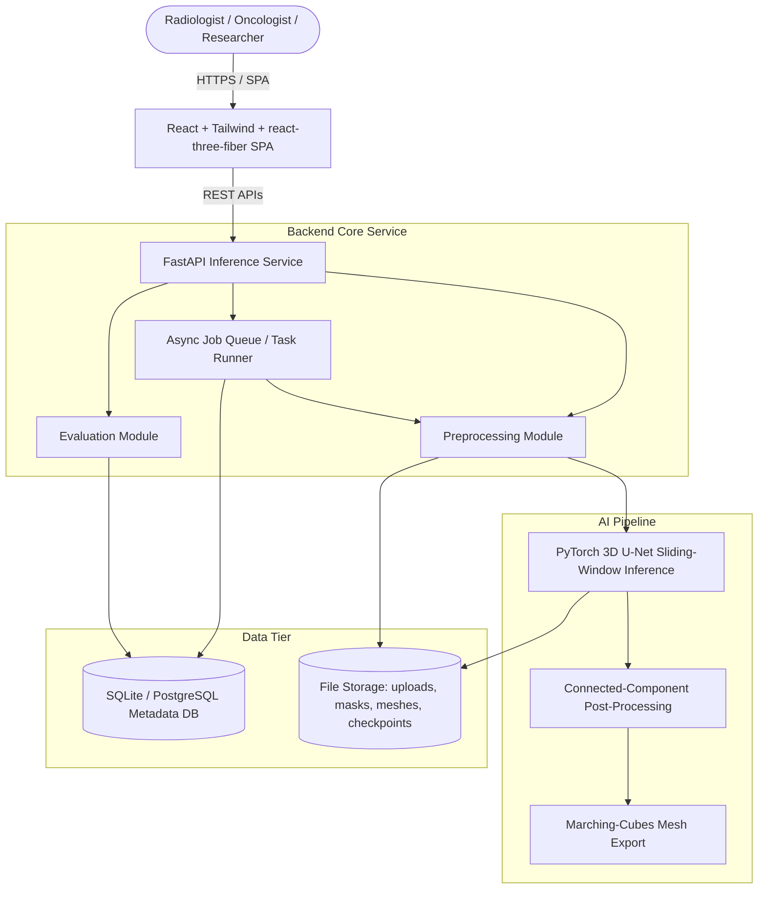

# Document 5 — High-Level Design (HLD)

## System Architecture Diagram

## Component Responsibilities
* **React SPA:** Handles case upload, 2D slice + 3D mesh rendering, results dashboard, and live job-status polling.
* **FastAPI Service:** Coordinates request routing, file uploads, async job orchestration, and structured logging.
* **Preprocessing Module:** Loads NIfTI volumes, reorients to a canonical frame, resamples to a fixed target spacing, applies per-modality foreground-only z-score normalization, and crops to the foreground bounding box.
* **PyTorch Inference Module:** Runs sliding-window inference over the preprocessed volume with Gaussian-weighted patch blending.
* **Evaluation Module:** Computes Dice and Hausdorff95 per class and in aggregate against ground truth when present.
* **Visualization Module:** Extracts a decimated 3D surface mesh (marching cubes) per sub-region for the react-three-fiber viewer.
* **SQLite / PostgreSQL:** Stores case/job/result metadata, per-class metrics, and the checkpoint registry.

## Request Flow: Case Segmentation Pipeline
1. User uploads a 4-modality case via `/upload`; the API validates request shape and creates a `case` + `job` record, returning a job ID immediately (`202 Accepted`).
2. The job queue picks up the job asynchronously; the Preprocessing Module validates file content and runs the full preprocessing pipeline (Document 9), writing intermediate tensors to file storage.
3. The Inference Module loads the requested (or default/latest) checkpoint and runs sliding-window inference, producing a probability map.
4. Post-processing argmaxes the probability map and removes spurious connected components below a configurable voxel threshold.
5. If ground truth was provided, the Evaluation Module computes Dice/HD95 per class and stores the metrics.
6. The Visualization Module extracts a 3D mesh from the mask and stores mesh data alongside the case.
7. The frontend polls/receives `GET /results/{id}`, which returns metrics, mesh reference, and case metadata for rendering.
