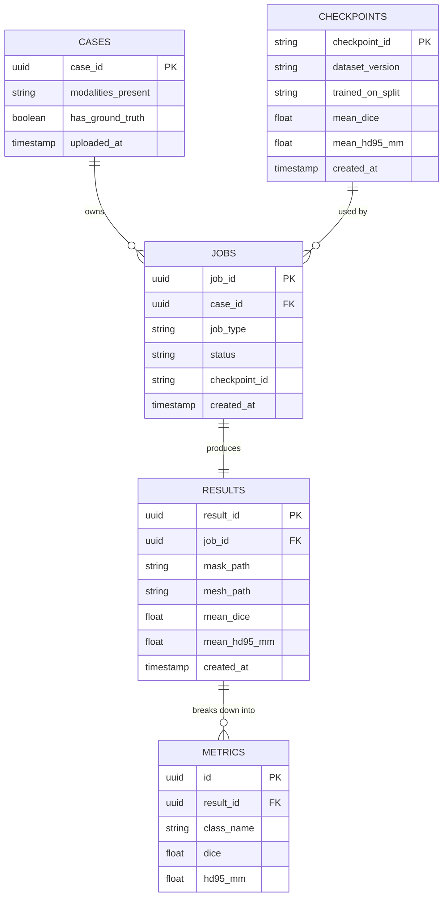

# Document 6 — Database / Data Design

## Entity Relationship Diagram

*(See `ERD_diagram.png` for the rendered version of this diagram.)*

## Database Schema Specification

### Table: `cases`
| Field | Type | Constraint | Description |
| :--- | :--- | :--- | :--- |
| `case_id` | UUID | Primary Key, Default `gen_random_uuid()` | Opaque, non-guessable case identifier |
| `modalities_present` | TEXT[] | Not Null | Which of T1/T1ce/T2/FLAIR were uploaded |
| `has_ground_truth` | BOOLEAN | Default `false` | Whether a `seg` file was provided |
| `uploaded_at` | TIMESTAMPTZ | Default `NOW()` | Upload timestamp |

### Table: `jobs`
| Field | Type | Constraint | Description |
| :--- | :--- | :--- | :--- |
| `job_id` | UUID | Primary Key | Opaque, server-generated job identifier |
| `case_id` | UUID | Foreign Key (`cases.case_id`) | Target case |
| `job_type` | VARCHAR(20) | `predict` \| `evaluate` | Which pipeline was requested |
| `status` | VARCHAR(20) | `queued`, `running`, `done`, `failed` | Job lifecycle state |
| `checkpoint_id` | VARCHAR(64) | Foreign Key (`checkpoints.checkpoint_id`) | Model version used |
| `created_at` | TIMESTAMPTZ | Default `NOW()` | Timestamp |

### Table: `results`
| Field | Type | Constraint | Description |
| :--- | :--- | :--- | :--- |
| `result_id` | UUID | Primary Key | Result identifier |
| `job_id` | UUID | Foreign Key (`jobs.job_id`), Unique | Owning job (1:1) |
| `mask_path` | TEXT | Not Null | Location of the resampled-back segmentation mask |
| `mesh_path` | TEXT | Nullable | Location of the exported 3D mesh, if generated |
| `mean_dice` | NUMERIC(5,4) | Nullable | Macro-average Dice across foreground classes |
| `mean_hd95_mm` | NUMERIC(6,2) | Nullable | Macro-average HD95 in millimeters |
| `created_at` | TIMESTAMPTZ | Default `NOW()` | Timestamp |

### Table: `metrics`
| Field | Type | Constraint | Description |
| :--- | :--- | :--- | :--- |
| `id` | UUID | Primary Key | Row identifier |
| `result_id` | UUID | Foreign Key (`results.result_id`) | Owning result |
| `class_name` | VARCHAR(30) | Not Null | e.g. `necrotic`, `edema`, `enhancing` |
| `dice` | NUMERIC(5,4) | Nullable | Per-class Dice (nullable when explicitly flagged undefined) |
| `hd95_mm` | NUMERIC(6,2) | Nullable | Per-class HD95 in millimeters |

### Table: `checkpoints`
| Field | Type | Constraint | Description |
| :--- | :--- | :--- | :--- |
| `checkpoint_id` | VARCHAR(64) | Primary Key | e.g. `unet3d-v1-ep180` |
| `dataset_version` | VARCHAR(64) | Not Null | Dataset release identifier used for training |
| `trained_on_split` | VARCHAR(30) | Not Null | e.g. `official_train` |
| `mean_dice` | NUMERIC(5,4) | Not Null | Headline validation Dice |
| `mean_hd95_mm` | NUMERIC(6,2) | Not Null | Headline validation HD95 |
| `created_at` | TIMESTAMPTZ | Default `NOW()` | Registration timestamp |

## Indexing Strategy
* B-tree index on `jobs(case_id)` and `jobs(status)` for fast case lookups and dashboard filtering by job state.
* B-tree index on `metrics(result_id)` for fast per-class metric retrieval on the Results Dashboard.
* Unique constraint on `results(job_id)` to enforce the 1:1 job→result relationship.
