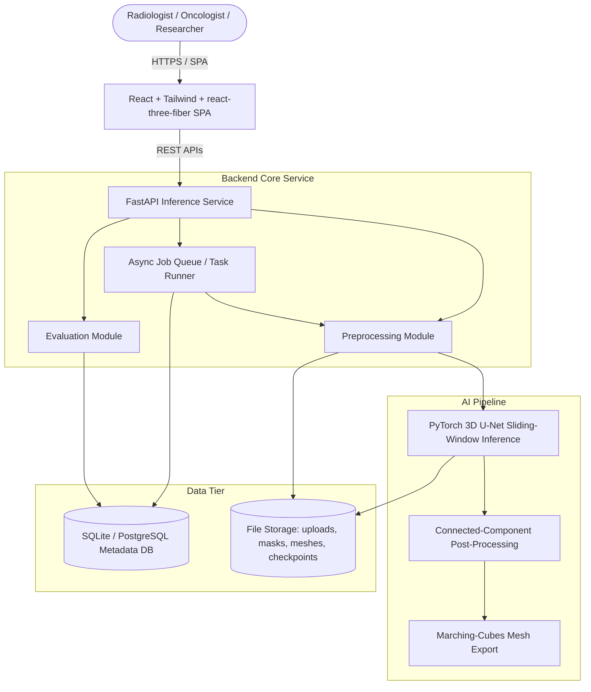
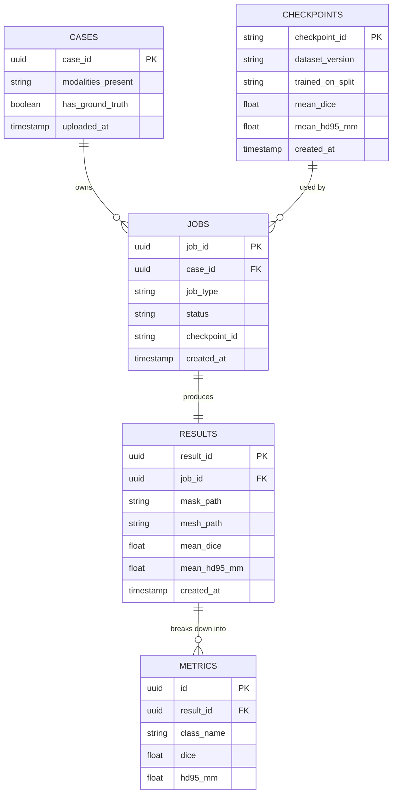

# Medical Image Segmentation & Tumor Detection 

For image and flowcharts refer this link - https://github.com/JAGADISHSUNILPEDNEKAR/Medical_Tumor_Segmentation-Tumor_Detection/edit/main/docs/Complete_PRD.md

## Complete Project Documentation — Multimodal AI Track

**Track:** Multimodal AI (Computer Vision)
**Stack:** Python · PyTorch · FastAPI · SQLite/PostgreSQL · React + Tailwind + react-three-fiber · BraTS
**Duration:** 3 Months | **Team Size:** 1–2 | **Level:** Advanced
**Positioning:** Research / decision-support prototype. **Not a diagnostic device. Not clinically validated.**

---

## Table of Contents

1. [Project Overview](#1-project-overview)
2. [Business Requirements Document (BRD)](#2-business-requirements-document-brd)
3. [Product Requirements Document (PRD)](#3-product-requirements-document-prd)
4. [UX Requirements](#4-ux-requirements)
5. [Technical Requirements Document (TRD)](#5-technical-requirements-document-trd)
6. [High-Level Design (HLD)](#6-high-level-design-hld)
7. [Database Design](#7-database-design)
8. [API Specification](#8-api-specification)
9. [Low-Level Design (LLD)](#9-low-level-design-lld)
10. [Multimodal AI Architecture](#10-multimodal-ai-architecture)
11. [Security Design](#11-security-design)
12. [Testing Strategy](#12-testing-strategy)
13. [CI/CD and Observability](#13-cicd-and-observability)
14. [Cost, Roadmap and Team](#14-cost-roadmap-and-team)
15. [Repository Structure and README](#15-repository-structure-and-readme)
16. [ADRs, Traceability, Interviews and Score](#16-adrs-traceability-interviews-and-score)

---

## 1. Project Overview

The **Medical Image Segmentation & Tumor Detection System** bridges multi-modal 3D brain MRI volumes (BraTS-format T1, T1ce, T2, FLAIR scans) with a full-stack decision-support application for visualizing and quantifying brain tumor sub-regions.

Manual delineation of tumor sub-regions (necrotic core, edema, enhancing tumor) in multi-modal MRI is slow, inter-observer variable, and a bottleneck in both clinical workflow and research. This project trains a custom 3D U-Net — conceptually grounded in nnU-Net (Isensee et al., *Nature Methods*, 2021) — on the BraTS dataset, wraps sliding-window inference in a FastAPI service, and exposes 2D slice + 3D mesh visualization plus Dice/Hausdorff95 evaluation through a React dashboard. It is delivered as a demonstrable, reproducible, end-to-end system: upload a scan → run inference → view the 3D segmentation → read Dice/HD95 metrics → view a results dashboard.

> **Positioning:** Research / decision-support prototype. **Not a diagnostic device. Not clinically validated.** Every clinical-facing screen carries a persistent non-clinical-use disclaimer.

```
       ┌────────────────────────────────────────────────────────┐
       │       RADIOLOGIST / ONCOLOGIST / ML RESEARCHER          │
       └───────────────────────────┬────────────────────────────┘
                                   │
               ┌───────────────────▼───────────────────┐
               │  REACT + TAILWIND 3D VIEWER DASHBOARD  │
               │  (2D Slice Viewer + react-three-fiber) │
               └───────────────────┬───────────────────┘
                                   │ REST APIs
               ┌───────────────────▼───────────────────┐
               │       FASTAPI INFERENCE SERVICE        │
               │   (Async Job Queue + Structured Logs)  │
               └───────────┬───────────────┬───────────┘
                           │               │
        ┌──────────────────┴──┐         ┌──┴──────────────────┐
        │  PYTORCH 3D U-NET   │         │ SQLITE / POSTGRES DB│
        │ - nnU-Net inspired  │         │ - Case/Job Records  │
        │ - Sliding Window    │         │ - Dice/HD95 Metrics │
        │ - Dice + CE Loss    │         │ - Checkpoint Registry│
        └─────────────────────┘         └─────────────────────┘
```

**Track:** Multimodal AI (Computer Vision) · **Dataset:** BraTS (Brain Tumor Segmentation Challenge) · **Duration:** 3 Months

---

## 2. Business Requirements Document (BRD)

### 1. Executive Summary
Manual delineation of tumor sub-regions in multi-modal MRI is slow, inter-observer variable, and a bottleneck in both clinical workflow and research. The **Medical Image Segmentation & Tumor Detection System** trains and demonstrates a custom 3D U-Net — conceptually grounded in nnU-Net's self-configuring methodology — on the BraTS dataset, then delivers the result through a full-stack app so it is inspectable, not just a notebook metric. The product's value is **transparency and reproducibility of a segmentation research pipeline**, not clinical decision-making authority.

### 2. Problem Statement
* **Current State:** Tumor sub-region delineation is performed manually by radiologists, slice by slice, with known inter-observer variability.
* **Affected Stakeholders:** Radiologists, oncologists, medical AI researchers, ML engineers/student evaluators.
* **Bottlenecks:** Slow manual annotation, lack of a reproducible research pipeline, no transparent way to inspect model quality beyond a single notebook metric.
* **Business/Academic Impact:** Segmentation research that isn't wrapped in a usable, reproducible system is hard to demo, hard to trust, and hard for a second person to reproduce.

### 3. Vision
To build a transparent, reproducible 3D segmentation research pipeline — from raw NIfTI volumes to a trained model to an inspectable full-stack application — that a radiologist, oncologist, or researcher can use to see *and* quantify candidate tumor sub-regions, without ever presenting itself as a diagnostic authority.

### 4. Objectives (SMART, derived from Goals & Success Criteria)
* **Model Correctness:** Train a 3D U-Net to convergence on the official BraTS training split, producing non-degenerate masks (not all-background) on held-out cases.
* **Evaluation Rigor:** Compute per-class and mean Dice and Hausdorff95 correctly, per case then aggregated, with every documented edge case (empty mask, absent class) handled explicitly rather than silently zeroed.
* **Demonstrability:** Run the full pipeline — upload → analyze → 3D view → metrics — live in a 5–10 minute demo without manual patching.
* **Reproducibility:** A second person can retrain/re-evaluate from config files and a README without asking the original author questions.

### 5. Target Personas
* **Persona 1: Radiologist (Reviewer)**
  * *Goals:* Fast visual localization of candidate tumor sub-regions to speed up manual review.
  * *Pain Points:* Needs to trust — but independently verify — anything a model proposes; should never infer the mask is diagnostic truth needing no verification.
  * *Tech Skill:* Intermediate web application user.
* **Persona 2: Oncologist**
  * *Goals:* Tumor volume and rough sub-region breakdown to support discussion, not decision.
  * *Pain Points:* Must not mistake a volume trend across scans for a validated clinical progression assessment (e.g., RANO criteria).
* **Persona 3: Medical AI Researcher / ML Engineer**
  * *Goals:* Reproducible Dice/HD95 numbers, checkpoint provenance, ability to re-run evaluation and cross-check against config files.
  * *Tech Skill:* Advanced, metric-literate.

### 6. User Journey
1. **Landing & Disclaimer:** User opens the app, reads the persistent non-clinical-use disclaimer.
2. **Case Upload:** User uploads (or selects) a 4-modality BraTS-format case (T1, T1ce, T2, FLAIR).
3. **Automated Pipeline:** System validates and preprocesses the volumes, runs sliding-window 3D U-Net inference, and (if ground truth is present) computes Dice/HD95.
4. **Visual Review:** User inspects 2D axial/coronal/sagittal slices with the segmentation overlay, then rotates/zooms/pans a 3D tumor mesh, toggling sub-regions on and off.
5. **Quantitative Report:** User reviews per-class and mean Dice/HD95, tumor volume, and the model/checkpoint version on the Results Dashboard.

### 7. Business Use Cases
* **UC-01:** Segment tumor sub-regions (necrotic core, edema, enhancing tumor) from a 4-modality MRI case.
* **UC-02:** Evaluate a segmentation against ground truth using Dice and Hausdorff95, per class and in aggregate.
* **UC-03:** Visually and quantitatively review a case via a 2D slice viewer and an interactive 3D tumor mesh.

### 8. Functional Business Requirements
| Requirement ID | Requirement Description | Priority | Business Justification | Acceptance Criteria |
| :--- | :--- | :--- | :--- | :--- |
| **BR-001** | 4-Modality Case Ingestion | High | Enable ingest of BraTS-format NIfTI cases with structural validation. | Reject cases missing any of T1/T1ce/T2/FLAIR with a specific error naming the missing modality. |
| **BR-002** | 3D Deep Learning Tumor Segmentation | High | Produce non-degenerate tumor sub-region masks via a custom 3D U-Net. | Trained checkpoint's validation Dice exceeds the trivial all-background baseline by a non-trivial margin. |
| **BR-003** | Quantitative Evaluation Engine | High | Compute field-standard Dice/HD95 metrics against ground truth. | Per-class and mean Dice/HD95 reported, matching the documented aggregation and edge-case rules exactly. |
| **BR-004** | 2D + 3D Visual Review Interface | High | Let reviewers inspect the mask against the anatomy, not just trust a number. | Users can toggle overlay visibility and rotate/zoom/pan a decimated 3D mesh at interactive frame rates. |
| **BR-005** | Reproducible Research Pipeline | Medium | Ensure the pipeline is independently rerunnable and auditable. | A second person can retrain/re-evaluate from `configs/` and the README without asking questions. |

### 9. Non-Functional Business Requirements
* **Performance:** End-to-end inference (preprocessing + sliding-window inference + post-processing) targeted under ~1–2 minutes per case on the target GPU (measured, not a guaranteed SLA).
* **Availability:** Single-instance academic/demo deployment; concurrent inference requests queued FIFO rather than parallel-executed and OOM-crashed.
* **Security & Privacy:** No real patient data — only public, de-identified BraTS research data; opaque non-guessable case/result IDs; no PHI ever logged.

### 10. Success Metrics
* Every documented functional requirement (§10 of the TRD) demonstrable live within a 5–10 minute demo.
* Dice and HD95 computed correctly and cross-checked against a hand-computed or independent reference implementation at least once.
* A second person can reproduce training/evaluation from configs and the README alone.

### 11. Assumptions
* A single GPU with enough memory for at least a modest 3D patch (e.g., 128³ at a reasonable batch size) is available for training.
* The team has, or will confirm, legitimate access to a BraTS release under its stated license terms.
* SQLite is sufficient for the metadata DB given the academic/demo scale of the project, with a documented upgrade path to PostgreSQL.

### 12. Constraints
* **Compute:** Single mid-tier GPU for both training and local inference serving.
* **Duration:** 3-month development cycle, sized for a 1–2 person engineering team (see Document 13).
* **Scope:** BraTS-defined MRI sequences only (T1, T1ce, T2, FLAIR) — no arbitrary DICOM ingestion, no PACS/EHR integration, no regulatory submission artifacts.

### 13. Risks & Mitigations
| Risk | Probability | Impact | Mitigation Strategy |
| :--- | :--- | :--- | :--- |
| GPU memory limitations block training at a useful patch size | Medium | High | Mixed-precision training, patch-based training by design, tunable patch size/channel width. |
| Class imbalance yields a degenerate all-background model | Medium | High | Compound Dice + Cross-Entropy loss with foreground-oversampled patch sampling. |
| Metric implementation errors undermine every downstream claim | Low–Medium | High | Unit tests against hand-computed synthetic cases; explicit empty-mask edge-case handling. |
| Scope creep (chasing full official nnU-Net integration, over-building auth/security) | Medium | High | Explicit MVP/V1/Stretch boundaries with a stated priority ordering; cut V1/Stretch first. |

### 14. MVP Scope
* **In Scope:** BraTS-format 4-modality preprocessing; custom 3D U-Net training; sliding-window inference; Dice + HD95 evaluation; FastAPI service with async job handling; React app (landing/disclaimer, upload, 2D slice + 3D mesh analysis workspace, results screen); README + architecture doc + model card; unit tests for preprocessing/metrics + one API integration path.
* **Out of Scope (MVP):** Multi-institution data harmonization, non-BraTS/raw-DICOM ingestion, clinical workflow (PACS/EHR) integration, production multi-tenant auth, regulatory submission artifacts.

### 15. Future Scope
* Case history with persisted past results, polished aggregate dashboard, basic auth/session handling (V1).
* Tumor volume estimation surfaced in the UI (V1); growth-tracking scaffold across timepoints, model versioning/comparison UI, confidence/uncertainty visualization (Stretch) — explicitly never presented as a validated clinical progression tool.

---

## 3. Product Requirements Document (PRD)

### Product Vision & Goals
Deliver a transparent, reproducible visual segmentation research tool that turns raw multi-modal BraTS MRI volumes into an inspectable 3D tumor visualization and a quantitative Dice/HD95 evaluation report — for radiologists, oncologists, and researchers alike.

### User Stories & Acceptance Criteria

#### US-01: Case Ingestion & Preprocessing
* **As a** Radiologist or Researcher,
* **I want to** upload a 4-modality BraTS-format MRI case (T1, T1ce, T2, FLAIR),
* **So that** the system can validate, preprocess, and prepare it for segmentation.
  * **Acceptance Criteria:**
    * Client-side validation catches a missing modality before (or alongside) the server round-trip, naming the specific missing file.
    * Server-side validation checks NIfTI structure, shape, and affine consistency across all 4 modalities before parsing proceeds further.
    * Upload progress indicator shown for realistic BraTS case file sizes.

#### US-02: 3D Visual Review of Segmentation
* **As a** Radiologist,
* **I want to** view 2D axial/coronal/sagittal slices with the segmentation overlay, and a rotatable 3D tumor mesh,
* **So that** I can visually verify sub-region boundaries rather than trust a single number.
  * **Acceptance Criteria:**
    * 2D slice viewer supports all 3 anatomical planes with an overlay toggle.
    * 3D mesh (marching-cubes, decimated to a bounded triangle budget) supports rotate/zoom/pan and per-sub-region visibility toggles.

#### US-03: Automated Dice/HD95 Evaluation Reporting
* **As a** Researcher or Oncologist,
* **I want the system to** automatically compute Dice and Hausdorff95 per class and in aggregate against ground truth,
* **So that** I get a field-standard, reproducible quantitative report without manual metric computation.
  * **Acceptance Criteria:**
    * Per-class and mean Dice/HD95 reported with case-level aggregation (mean across cases, not a pooled voxel count).
    * Empty-mask and absent-class edge cases explicitly flagged, never silently zeroed.
    * Report includes evaluation split, case count, checkpoint ID, and a timestamp.

### Feature Priorities (MoSCoW)
* **Must Have:** BraTS preprocessing pipeline, custom 3D U-Net + sliding-window inference, Dice/HD95 evaluation module, 2D slice + 3D mesh viewer, FastAPI async job API, non-clinical-use disclaimer on every result screen.
* **Should Have:** Tumor volume estimation (mm³/cm³) surfaced in the UI, polished aggregate dashboard (Dice/HD95 distributions, per-class table), basic auth/session handling.
* **Could Have:** Case history screen with persisted past results, model versioning UI (compare two checkpoints).
* **Won't Have (for MVP):** Growth-tracking across timepoints, confidence/uncertainty visualization, official nnU-Net framework integration, DICOM/PACS/EHR ingestion.

---

## 4. UX Requirements

### Information Architecture & Routing Structure
* `/` — Landing/Home: project purpose, model summary (checkpoint version, dataset, headline Dice/HD95), persistent non-clinical-use disclaimer, "Upload a case" CTA.
* `/upload` — Case Selection: drag-and-drop + file picker for the 4 required modality files (or a pre-packaged case archive).
* `/cases/:id/analysis` — Analysis Workspace: 2D slice viewer + embedded 3D tumor-mesh viewer, live inference status polling.
* `/cases/:id/results` — Results Dashboard: per-class/mean Dice + HD95, tumor volume, checkpoint version, embedded 3D view for side-by-side review.
* `/history` — (V1) List of previously processed cases with timestamp, headline metrics, and model version used at the time.

### User Flows: Case Analysis Flow
```
[Read Disclaimer] ──► [Upload 4-Modality Case] ──► [Preprocess & Sliding-Window Inference]
                                                              │
[Review Results Dashboard] ◄── [2D Slice + 3D Mesh Review] ◄──┘
```

### Screen Requirements: Analysis Workspace Screen (`/cases/:id/analysis`)
* **Purpose:** Let the reviewer inspect AI-predicted tumor sub-regions against the underlying anatomy before trusting any metric.
* **Components:**
  * Modality selector + segmentation-overlay toggle for the 2D slice viewer (axial/coronal/sagittal), with a scroll/slider to move through slices.
  * Embedded 3D tumor-mesh viewer (react-three-fiber): rotate/zoom/pan, per-sub-region visibility toggle, consistent documented color legend.
  * Case metadata panel: case ID, modalities present, upload timestamp, live inference job status (queued/running/done/failed).
* **States:**
  * *Loading:* Skeleton loader during preprocessing & sliding-window inference.
  * *Error:* Specific message for invalid file, missing modality, or corrupted NIfTI — never a raw stack trace.
  * *Empty:* "No case selected yet" prompt back to `/upload`.

### Accessibility & Responsive Design
* Contrast ratio ≥ 4.5:1 for all text elements per WCAG 2.1 AA.
* Keyboard shortcut navigation for slice step-through (`KeyJ` / `KeyL`, mirroring standard radiology-tool conventions).
* Meshes decimated/vertex-capped so the 3D viewer maintains interactive frame rates on a typical laptop GPU.
* Every screen displaying a segmentation result carries a visible, persistently rendered non-clinical-use disclaimer.

---

## 5. Technical Requirements Document (TRD)

### 1. Technical Goals
* Build a 3D segmentation pipeline whose preprocessing, training, and evaluation methodology is conceptually grounded in nnU-Net, without depending on the official nnU-Net framework as a library.
* Achieve a deployable end-to-end pipeline (preprocessing + sliding-window inference + post-processing) targeted under ~1–2 minutes per case on a single target GPU.

### 2. Technology Selection & Rationale
* **Frontend: React + Tailwind CSS + react-three-fiber + Axios**
  * *Why:* react-three-fiber gives idiomatic React integration for rendering a marching-cubes surface mesh with per-sub-region color, at far lower setup cost than a purpose-built medical volume renderer (vtk.js), which is reserved for a V1/stretch upgrade if full volumetric ray-casting is ever needed.
* **Backend: FastAPI (Python)**
  * *Why:* Async background execution for inference/evaluation jobs that are too slow to run synchronously in a single HTTP request; native OpenAPI docs; clean integration with the PyTorch inference module.
* **AI/ML: PyTorch + a custom 3D U-Net (nnU-Net-inspired) + nibabel/SimpleITK**
  * *Why:* A custom, from-scratch, config-driven 3D U-Net satisfies the learning objective of implementing the architecture/loss/training loop directly, avoids debugging a large third-party framework's internals under a 3-month deadline, and keeps full control over inference latency and output format for a smooth live demo.
* **Database: SQLite (MVP) with a documented PostgreSQL upgrade path**
  * *Why:* Zero-ops, file-based, sufficient for a single-instance academic deployment; upgrade path exists if concurrent multi-user load ever requires it.

### 3. System Non-Functional Technical Targets
* **Model Inference Latency:** End-to-end (preprocessing + sliding-window inference + post-processing) targeted under ~1–2 minutes per case — a measured, reported number, not a guaranteed SLA.
* **Determinism:** Same checkpoint + same input + fixed seed → identical output mask on repeat runs (no test-time-augmentation randomness by default).
* **API Behavior:** Every inference-triggering endpoint returns a job ID immediately (`202 Accepted`); results are fetched via a polling `GET /results/{id}` endpoint.

### 4. Functional Technical Requirements Mapping
| Requirement ID | Technical Requirement | Architectural Mapping |
| :--- | :--- | :--- |
| **TR-001** | Validate and preprocess a 4-modality BraTS case (orientation, resampling, foreground-only normalization). | Preprocessing Module — `nibabel`/SimpleITK pipeline (Document 9). |
| **TR-002** | Execute a custom 3D U-Net via sliding-window inference with Gaussian-weighted stitching. | PyTorch Inference Module wrapped in FastAPI background tasks. |
| **TR-003** | Compute Dice and Hausdorff95 per class and in aggregate, with documented edge-case handling. | Evaluation Module — physical-spacing-aware surface-distance computation. |
| **TR-004** | Extract a decimated 3D surface mesh from the predicted mask. | Visualization Module — `scikit-image.measure.marching_cubes`, exported as glTF/GLB or vertex/face JSON. |

---

## 6. High-Level Design (HLD)

### System Architecture Diagram



### Component Responsibilities
* **React SPA:** Handles case upload, 2D slice + 3D mesh rendering, results dashboard, and live job-status polling.
* **FastAPI Service:** Coordinates request routing, file uploads, async job orchestration, and structured logging.
* **Preprocessing Module:** Loads NIfTI volumes, reorients to a canonical frame, resamples to a fixed target spacing, applies per-modality foreground-only z-score normalization, and crops to the foreground bounding box.
* **PyTorch Inference Module:** Runs sliding-window inference over the preprocessed volume with Gaussian-weighted patch blending.
* **Evaluation Module:** Computes Dice and Hausdorff95 per class and in aggregate against ground truth when present.
* **Visualization Module:** Extracts a decimated 3D surface mesh (marching cubes) per sub-region for the react-three-fiber viewer.
* **SQLite / PostgreSQL:** Stores case/job/result metadata, per-class metrics, and the checkpoint registry.

### Request Flow: Case Segmentation Pipeline
1. User uploads a 4-modality case via `/upload`; the API validates request shape and creates a `case` + `job` record, returning a job ID immediately (`202 Accepted`).
2. The job queue picks up the job asynchronously; the Preprocessing Module validates file content and runs the full preprocessing pipeline (Document 9), writing intermediate tensors to file storage.
3. The Inference Module loads the requested (or default/latest) checkpoint and runs sliding-window inference, producing a probability map.
4. Post-processing argmaxes the probability map and removes spurious connected components below a configurable voxel threshold.
5. If ground truth was provided, the Evaluation Module computes Dice/HD95 per class and stores the metrics.
6. The Visualization Module extracts a 3D mesh from the mask and stores mesh data alongside the case.
7. The frontend polls/receives `GET /results/{id}`, which returns metrics, mesh reference, and case metadata for rendering.

---

## 7. Database Design

### Entity Relationship Diagram



*(See `ERD_diagram.png` for the rendered version of this diagram.)*

### Database Schema Specification

#### Table: `cases`
| Field | Type | Constraint | Description |
| :--- | :--- | :--- | :--- |
| `case_id` | UUID | Primary Key, Default `gen_random_uuid()` | Opaque, non-guessable case identifier |
| `modalities_present` | TEXT[] | Not Null | Which of T1/T1ce/T2/FLAIR were uploaded |
| `has_ground_truth` | BOOLEAN | Default `false` | Whether a `seg` file was provided |
| `uploaded_at` | TIMESTAMPTZ | Default `NOW()` | Upload timestamp |

#### Table: `jobs`
| Field | Type | Constraint | Description |
| :--- | :--- | :--- | :--- |
| `job_id` | UUID | Primary Key | Opaque, server-generated job identifier |
| `case_id` | UUID | Foreign Key (`cases.case_id`) | Target case |
| `job_type` | VARCHAR(20) | `predict` \| `evaluate` | Which pipeline was requested |
| `status` | VARCHAR(20) | `queued`, `running`, `done`, `failed` | Job lifecycle state |
| `checkpoint_id` | VARCHAR(64) | Foreign Key (`checkpoints.checkpoint_id`) | Model version used |
| `created_at` | TIMESTAMPTZ | Default `NOW()` | Timestamp |

#### Table: `results`
| Field | Type | Constraint | Description |
| :--- | :--- | :--- | :--- |
| `result_id` | UUID | Primary Key | Result identifier |
| `job_id` | UUID | Foreign Key (`jobs.job_id`), Unique | Owning job (1:1) |
| `mask_path` | TEXT | Not Null | Location of the resampled-back segmentation mask |
| `mesh_path` | TEXT | Nullable | Location of the exported 3D mesh, if generated |
| `mean_dice` | NUMERIC(5,4) | Nullable | Macro-average Dice across foreground classes |
| `mean_hd95_mm` | NUMERIC(6,2) | Nullable | Macro-average HD95 in millimeters |
| `created_at` | TIMESTAMPTZ | Default `NOW()` | Timestamp |

#### Table: `metrics`
| Field | Type | Constraint | Description |
| :--- | :--- | :--- | :--- |
| `id` | UUID | Primary Key | Row identifier |
| `result_id` | UUID | Foreign Key (`results.result_id`) | Owning result |
| `class_name` | VARCHAR(30) | Not Null | e.g. `necrotic`, `edema`, `enhancing` |
| `dice` | NUMERIC(5,4) | Nullable | Per-class Dice (nullable when explicitly flagged undefined) |
| `hd95_mm` | NUMERIC(6,2) | Nullable | Per-class HD95 in millimeters |

#### Table: `checkpoints`
| Field | Type | Constraint | Description |
| :--- | :--- | :--- | :--- |
| `checkpoint_id` | VARCHAR(64) | Primary Key | e.g. `unet3d-v1-ep180` |
| `dataset_version` | VARCHAR(64) | Not Null | Dataset release identifier used for training |
| `trained_on_split` | VARCHAR(30) | Not Null | e.g. `official_train` |
| `mean_dice` | NUMERIC(5,4) | Not Null | Headline validation Dice |
| `mean_hd95_mm` | NUMERIC(6,2) | Not Null | Headline validation HD95 |
| `created_at` | TIMESTAMPTZ | Default `NOW()` | Registration timestamp |

### Indexing Strategy
* B-tree index on `jobs(case_id)` and `jobs(status)` for fast case lookups and dashboard filtering by job state.
* B-tree index on `metrics(result_id)` for fast per-class metric retrieval on the Results Dashboard.
* Unique constraint on `results(job_id)` to enforce the 1:1 job→result relationship.

---

## 8. API Specification

Base path: `/api/v1`

### 1. Health Check
* **Endpoint:** `GET /api/v1/health`
* **Authorization:** None
* **Response (200 OK):**
```json
{
  "status": "ok",
  "model_loaded": true
}
```

### 2. Model Info
* **Endpoint:** `GET /api/v1/model/info`
* **Authorization:** None (V1: session-gated)
* **Response (200 OK):**
```json
{
  "checkpoint_id": "unet3d-v1-ep180",
  "dataset_version": "brats-2021-v1",
  "trained_on_split": "official_train",
  "headline_metrics": {"mean_dice": 0.81, "mean_hd95_mm": 4.2},
  "num_classes": 4,
  "input_modalities": ["T1", "T1ce", "T2", "FLAIR"]
}
```

### 3. Submit Case for Segmentation
* **Endpoint:** `POST /api/v1/predict`
* **Authorization:** None (V1: session-gated)
* **Request:** `multipart/form-data` with 4 named file fields (`t1`, `t1ce`, `t2`, `flair`)
* **Response (202 Accepted):**
```json
{
  "job_id": "job_9f1a3b21",
  "status": "queued"
}
```
* **Errors:** `400` missing modality; `413` file too large; `422` unparsable NIfTI.

### 4. Submit Case for Evaluation
* **Endpoint:** `POST /api/v1/evaluate`
* **Authorization:** None (V1: session-gated)
* **Request:** As `/predict`, plus a `seg` ground-truth file field.
* **Response (202 Accepted):**
```json
{
  "job_id": "job_9f1a3b22",
  "status": "queued"
}
```
* **Errors:** As `/predict`, plus `400` if `seg` shape doesn't match the image modalities.

### 5. Poll / Fetch Job Result
* **Endpoint:** `GET /api/v1/results/{id}`
* **Authorization:** None (V1: session-gated; only the owning session may fetch)
* **Response (200 OK, done):**
```json
{
  "job_id": "job_9f1a3b22",
  "status": "done",
  "case_id": "case_7d2e1a90",
  "mask_url": "/api/v1/cases/case_7d2e1a90/mask",
  "mesh_url": "/api/v1/cases/case_7d2e1a90/mesh",
  "metrics": {
    "dice": {"necrotic": 0.71, "edema": 0.84, "enhancing": 0.79, "mean": 0.78},
    "hd95_mm": {"necrotic": 5.1, "edema": 3.2, "enhancing": 4.0, "mean": 4.1}
  },
  "checkpoint_id": "unet3d-v1-ep180",
  "created_at": "2026-08-27T10:00:00Z"
}
```
* **Response (200 OK, running):** `{"job_id": "...", "status": "running"}`
* **Response (200 OK, failed):** `{"job_id": "...", "status": "failed", "error": "oom", "detail": "..."}`
* **Errors:** `404` unknown job ID.

### 6. List Cases (V1 — History Screen)
* **Endpoint:** `GET /api/v1/cases`
* **Authorization:** Session-gated
* **Response (200 OK):** Paginated array of `CaseSummary` objects.

### 7. Aggregate Dashboard Metrics
* **Endpoint:** `GET /api/v1/metrics`
* **Authorization:** Session-gated
* **Response (200 OK):** Aggregate Dice/HD95 distributions, per-class breakdown, inference-time statistics across all/filtered evaluated cases.

---

## 9. Low-Level Design (LLD)

### Module Architecture & Design Patterns

#### Repository Pattern (Data Access Layer)
Abstracts metadata-DB access away from the API route handlers.
* Class: `CaseRepository`
  * `get_by_id(case_id: UUID) -> Case`
  * `create(modalities_present: list[str], has_ground_truth: bool) -> Case`
* Class: `JobRepository`
  * `create(case_id: UUID, job_type: str) -> Job`
  * `update_status(job_id: UUID, status: str) -> None`

#### Pipeline Pattern (Preprocessing → Inference → Post-processing)
Each stage is an independently testable, independently executable unit, callable both from the FastAPI job runner and as a standalone CLI script.

```
                    ┌─────────────────────────────────┐
                    │      PipelineStage              │
                    │      <<Interface>>               │
                    │  +run(volume) -> volume          │
                    └────────────────┬────────────────┘
                                     │
   ┌─────────────────────┬───────────────────────┬─────────────────────┐
   │                      │                       │                     │
┌──┴──────────────┐  ┌────┴────────────┐  ┌───────┴───────────┐  ┌──────┴──────────┐
│ PreprocessStage  │  │ InferenceStage  │  │ PostProcessStage  │  │ VizExportStage  │
│ (resample+norm)  │  │ (sliding-window)│  │ (CC filtering)    │  │ (marching cubes)│
└──────────────────┘  └─────────────────┘  └────────────────────┘  └─────────────────┘
```

### Key Algorithms

#### 1. Sliding-Window Inference with Gaussian-Weighted Blending
```python
import numpy as np
import torch

def sliding_window_infer(volume: np.ndarray, model, patch_size=(128, 128, 128), overlap=0.5) -> np.ndarray:
    """Tile the volume into overlapping patches, run the model on each,
    and blend overlapping predictions with a Gaussian weight (heavier at patch
    centers, lighter at patch edges) to avoid seam artifacts at patch borders."""
    gaussian_weight = _make_gaussian_kernel(patch_size)
    prob_map = np.zeros((model.num_classes, *volume.shape), dtype=np.float32)
    weight_map = np.zeros(volume.shape, dtype=np.float32)

    for patch, coords in _iter_patches(volume, patch_size, overlap):
        with torch.no_grad():
            logits = model(torch.from_numpy(patch).unsqueeze(0))
            probs = torch.softmax(logits, dim=1).squeeze(0).numpy()
        prob_map[:, *coords] += probs * gaussian_weight
        weight_map[coords] += gaussian_weight

    prob_map /= np.clip(weight_map, a_min=1e-6, a_max=None)
    return prob_map
```

#### 2. Dice Coefficient (per class, with documented edge-case handling)
```python
def dice_score(pred_mask: np.ndarray, gt_mask: np.ndarray, class_id: int, eps: float = 1e-6) -> float | None:
    pred_c = (pred_mask == class_id)
    gt_c = (gt_mask == class_id)

    if not gt_c.any() and not pred_c.any():
        return 1.0  # perfect agreement on absence — documented convention

    intersection = np.logical_and(pred_c, gt_c).sum()
    denom = pred_c.sum() + gt_c.sum()
    return float((2.0 * intersection + eps) / (denom + eps))
```

#### 3. Connected-Component Post-Processing
```python
from scipy import ndimage

def filter_small_components(mask: np.ndarray, min_voxels: int = 50) -> np.ndarray:
    cleaned = np.zeros_like(mask)
    for class_id in np.unique(mask):
        if class_id == 0:
            continue
        labeled, num_features = ndimage.label(mask == class_id)
        for i in range(1, num_features + 1):
            component = (labeled == i)
            if component.sum() >= min_voxels:
                cleaned[component] = class_id
    return cleaned
```

---

## 10. Multimodal AI Architecture

### 1. Modalities Handled
* **Volumetric Image Modality:** Four co-registered, skull-stripped MRI NIfTI volumes per case — native T1, post-contrast T1 (T1ce/T1Gd), T2, and T2-FLAIR.
* **Label Modality:** A voxel-wise segmentation label map (background + tumor sub-region classes) when ground truth is available.
* **Structured Data Modality:** Case/job/result metadata, checkpoint provenance, and per-class evaluation metrics.

### 2. Multimodal Processing Pipeline

```
       ┌────────────────────────┐             ┌────────────────────────┐
       │ 4-Modality NIfTI Case  │             │ Ground-Truth Seg Mask  │
       │ (T1, T1ce, T2, FLAIR)  │             │  (if available)        │
       └───────────┬────────────┘             └───────────┬────────────┘
                   │                                      │
        ┌──────────▼───────────┐               ┌──────────▼───────────┐
        │ Preprocessing        │               │ Evaluation Engine    │
        │ - Orientation/Resample│               │ - Dice (per class)   │
        │ - Foreground Z-Score  │               │ - Hausdorff95 (mm)   │
        └──────────┬───────────┘               └──────────┬───────────┘
                   │                                      │
                   │    ┌────────────────────────────┐    │
                   └───►│ 3D U-Net Inference Engine  │◄───┘
                        │ - Sliding-Window + Gaussian│
                        │ - Argmax + CC Filtering    │
                        └─────────────┬──────────────┘
                                      │
                        ┌─────────────▼──────────────┐
                        │ Mask + Mesh + Metrics       │
                        └────────────────────────────┘
```

### 3. Model Architecture & Training Design
* **Base Architecture:** Custom 3D U-Net — symmetric encoder/decoder with channel-wise skip concatenation.
  * Encoder: 4–5 stages, each two 3×3×3 conv blocks followed by strided-conv downsampling by 2×.
  * Decoder: mirrors encoder depth; transposed-conv (or trilinear upsample + conv) upsampling, concatenated with the matching encoder skip.
  * Normalization: **InstanceNorm3d** — batch-independent, standard for 3D medical segmentation given the very small batch sizes (1–4 patches) that 3D volumetric training requires.
  * Activation: LeakyReLU (negative slope ≈ 0.01).
  * Channels: starting width 16–32, doubling per downsampling stage, capped (e.g., 320) to bound GPU memory.
  * Input: `(4, D, H, W)` per-case tensor; Output: `(C, D, H, W)`, `C` = background + tumor sub-regions.
* **Transfer of Ideas from nnU-Net (not the framework itself):** dataset fingerprinting, resampling to a fingerprinted target spacing, foreground-only z-score normalization, patch-based training with foreground oversampling, compound Dice+CE loss, sliding-window inference with Gaussian-weighted stitching, and connected-component post-processing are all adopted conceptually; the official nnU-Net codebase, its automatic architecture search, and full 5-fold ensembling are **not** adopted for MVP.
* **Loss Function:** Compound Dice + Cross-Entropy —
$$
\mathcal{L} = \mathcal{L}_{CE} + \frac{1}{|C_{fg}|}\sum_{c \in C_{fg}} \mathcal{L}_{Dice}^{c}
$$
  combining CE's stable per-voxel gradient with Dice's overlap-focused, imbalance-robust signal.
* **Optimizer/Schedule:** SGD with Nesterov momentum (≈0.99) or AdamW as an easier-to-tune fallback; polynomial LR decay.
* **Data Augmentation:** Sagittal-axis flips, small-angle rotation, light scaling/intensity shift/gamma/Gaussian noise — all chosen to respect brain anatomy (no anterior-posterior or superior-inferior flips) and to avoid over-aggressive elastic deformation that would corrupt HD95-sensitive boundary shape.

### 4. Evaluation Metrics
* **Dice coefficient**, per class: $Dice_c = \dfrac{2|P_c \cap G_c|}{|P_c| + |G_c|}$ — computed per case, then macro-averaged across cases (never a single pooled voxel count).
* **Hausdorff95 (HD95)**: the 95th percentile of the surface-distance distribution between predicted and ground-truth boundaries, computed in physical millimeters (via voxel spacing, not voxel-index distance). Chosen over raw Hausdorff distance because HD is dominated by a single worst-case outlier voxel, making it unstable for model comparison — HD95 discards the top 5% most extreme distances while still penalizing genuine boundary disagreement, which is why it is the field-standard reported in BraTS leaderboards.
* **Edge cases:** both-empty → Dice = 1.0 / HD95 = 0 (documented, flagged in logs); one-sided-empty for HD95 → explicitly reported as "undefined," never substituted with a numeric placeholder.

---

## 11. Security Design

### 1. Authentication & Authorization
* **Authentication:** MVP ships without gated auth (single-user/small-class demo); V1 adds basic session-based authentication.
* **Role-Based Access Control (RBAC), V1:**
  * `Researcher` / `Radiologist Reviewer`: Can upload cases, run predict/evaluate jobs, and view their own case results.
  * `Admin`: Full checkpoint/config management and cross-session case visibility for debugging.
* Even in a demo/academic deployment, one session must not be able to browse another's cases by guessing IDs — enforced via opaque, non-guessable, server-generated case/job/result identifiers (never sequential integers).

### 2. Input Validation & Media Security
* Every uploaded file is validated server-side (NIfTI header parse, 4-modality shape/affine consistency check) before it reaches any parsing library — client-side validation is never trusted alone.
* Upload size limits enforced at the web-server layer, not only in application code (illustrative cap: 500 MB per case, tuned once real case sizes are confirmed against the chosen BraTS release).
* Uploaded cases and results are stored in a location that is not publicly web-accessible.

### 3. Data Privacy
* No real patient data is used in development — only public, de-identified BraTS research data; no additional real clinical data may be introduced without institutional review and explicit legal clearance (out of scope for this project).
* Logs never contain uploaded file contents, voxel data, or any field that could re-identify a case beyond its internal system-generated ID.
* A data-deletion path (endpoint or admin script) exists to remove an uploaded case and its derived results.
* HTTPS required for any non-local deployment; secrets (session secrets, DB credentials) supplied via environment variables, never committed to the repository.

### 4. Compliance Disclaimer
This project is an academic/research prototype and is **not automatically HIPAA/GDPR compliant** merely because these controls exist. Achieving actual regulatory compliance would require a formal risk assessment, a designated compliance officer, signed data-processing agreements, audited infrastructure, and — for HIPAA specifically — a Business Associate Agreement with any cloud vendor used; none of that is in scope here.

---

## 12. Testing Strategy

### Test Cases

| Test ID | Category | Scenario | Input | Expected Outcome | Priority |
| :--- | :--- | :--- | :--- | :--- | :--- |
| **TEST-01** | Unit | Dice/HD95 computed on synthetic arrays with known, hand-computed values | Two small synthetic masks with a known overlap | Computed Dice/HD95 match the hand-computed expected values, including empty-mask edge cases. | High |
| **TEST-02** | Unit | Resampling preserves the label set on ground-truth masks | A label mask with classes `{0,1,2,4}` resampled via nearest-neighbor | Resampled mask contains only the original label set — no fractional/interpolated classes introduced. | High |
| **TEST-03** | Integration | Model forward pass produces the expected tensor shape | Dummy input tensor `(1, 4, 128, 128, 128)` | Output tensor of shape `(1, C, 128, 128, 128)` where `C` = number of classes. | High |
| **TEST-04** | API | Upload a case missing one modality | 3 of 4 required modality files | API returns HTTP 400 with a machine-readable error naming the missing modality. | Medium |
| **TEST-05** | System E2E | End-to-end upload → mask → metrics → mesh pipeline | One fixture 4-modality case with ground truth | Job reaches `done` status; response includes a valid `mask_url`, computed metrics, and a `mesh_url`. | High |

---

## 13. CI/CD and Observability

### 1. CI/CD Pipeline Design

```
[Developer Push] ──► [GitHub Actions Triggered]
                           │
             ┌─────────────┴─────────────┐
             ▼                           ▼
    [Lint & Code Style]        [PyTest Unit Suite]
   (Flake8 / Black / ESLint)  (Preprocessing, Metrics, API)
             │                           │
             └─────────────┬─────────────┘
                           ▼
              [Build Docker Container]
                           │
                           ▼
          [Deploy to Single-GPU Server]
```

#### GitHub Actions Workflow Configuration
* Automatic runs on `push` to `main` or `pull_request`.
* Steps:
  1. Checkout repository code.
  2. Set up Python (backend/ML) and Node.js (frontend) environments.
  3. Install PyTorch (CPU mode, for fast CI execution) and backend dependencies.
  4. Run the PyTest suite (`tests/unit`, `tests/integration`).
  5. Run frontend tests via Vitest/Jest.

### 2. Observability & Monitoring
* **API Metrics:** Request latency (p95, p99), HTTP status code distribution, throughput (requests/sec).
* **Compute Metrics:** GPU VRAM utilization (peak allocated, to debug OOM errors), GPU/CPU/memory utilization.
* **ML Inference Metrics:** Per-stage processing time (preprocessing, inference, evaluation, mesh export), per job.
* **Structured Logging:** JSON logs including request ID, job/inference ID, model/checkpoint version, and timestamp — never uploaded voxel data or patient-identifying metadata.

### 3. Deployment Architecture

```
                       ┌─────────────────────────┐
                       │      NGINX REVERSE      │
                       │     PROXY (PORT 80/443) │
                       └────────────┬────────────┘
                                    │
           ┌────────────────────────┴────────────────────────┐
           │                                                 │
┌──────────▼──────────────┐                       ┌──────────▼──────────────┐
│  Frontend Container     │                       │  Backend Container      │
│  (React Static Build)   │                       │  (FastAPI + PyTorch)    │
└─────────────────────────┘                       └──────────┬──────────────┘
                                                             │
                                                  ┌──────────▼──────────────┐
                                                  │  Database Container     │
                                                  │  (SQLite / PostgreSQL)  │
                                                  └─────────────────────────┘
```

* **Local development:** `docker-compose` bringing up backend + a dev-mode frontend against a local SQLite DB and local file storage; CPU inference acceptable for dev iteration if no GPU is available.
* **GPU deployment:** hosting target not fixed by this document — a single cloud GPU VM (stopped outside active demo/eval windows to control cost), a lab-provided GPU box, or a managed inference endpoint are all acceptable; verify actual GPU resources before pinning the Dockerfile's CUDA/PyTorch base image.

---

## 14. Cost, Roadmap and Team

### 1. Cost Analysis (Monthly Estimate)

| Category | Component Description | Provider / Specification | Estimated Monthly Cost (USD) |
| :--- | :--- | :--- | :--- |
| **Compute / GPU** | Single GPU Server Instance (3D volumes need more VRAM than 2D CV tasks) | Dedicated GPU Server (e.g., RTX 4090 / 1x A10) | $220.00 |
| **Database** | SQLite (file-based, MVP) → PostgreSQL (V1) | Co-located on compute host (Dockerized) | $0.00 |
| **Storage** | Object / Disk Storage for NIfTI cases, masks & checkpoints | 250 GB NVMe Storage Block | $18.00 |
| **Networking** | Bandwidth egress | 500 GB Data Transfer | $10.00 |
| **Total** | | | **~$248.00 / month** |

*Illustrative estimate — per Document 1's risk register, train in short checkpointed sessions and run the GPU inference endpoint only during active demo/grading windows to control actual spend.*

### 2. Project Roadmap (3 Months)
* **Month 1 — Foundations:** Study nnU-Net paper & 3D U-Net fundamentals; confirm the exact BraTS release/access; build the preprocessing pipeline (v1); scaffold FastAPI + React; smoke-test a baseline training run.
* **Month 2 — Core ML + API:** Full training & tuning; sliding-window inference; Dice/HD95 evaluation implementation; FastAPI endpoints (`predict`/`evaluate`/`results`); frontend upload & analysis screens.
* **Month 3 — Integration + Polish:** Full frontend/backend integration; 3D visualization (mesh pipeline + viewer); dashboard + history; unit/integration/E2E testing; documentation (README/ARCHITECTURE/MODEL_CARD/etc.); deployment; demo & final presentation prep.

### 3. Team Responsibilities (1–2 Person Team)
* **Role A — AI/ML Lead & Backend Architect:**
  * BraTS dataset acquisition, fingerprinting, and preprocessing pipeline implementation.
  * Custom 3D U-Net design, training loop, compound Dice+CE loss, and checkpoint management.
  * FastAPI async job orchestration and Dice/HD95 evaluation module.
* **Role B — Full-Stack & Visualization Lead:**
  * React SPA: upload flow, 2D slice viewer, react-three-fiber 3D mesh viewer.
  * Results Dashboard and (V1) case history screen.
  * Docker Compose containerization, CI/CD pipeline setup, and documentation.

*For a solo team, both role sets are carried by the same person across the 3-month timeline above.*

---

## 15. Repository Structure and README

### 1. GitHub Repository Structure

```
medical-image-segmentation-tumor-detection/
├── backend/                # FastAPI application
│   ├── app/
│   │   ├── api/            # route definitions, versioned (v1/)
│   │   ├── core/           # config loading, logging setup
│   │   ├── models/         # Pydantic request/response schemas
│   │   ├── db/              # DB models + migrations
│   │   ├── services/       # job orchestration, calls into ml/
│   │   └── main.py
│   └── tests/
├── ml/                      # ML pipeline — independently executable, no FastAPI dependency
│   ├── data/                # dataset loading, splitting, fingerprinting
│   ├── preprocessing/       # resample / normalize / crop stages
│   ├── model/               # 3D U-Net definition
│   ├── training/            # training loop, compound Dice+CE loss
│   ├── inference/           # sliding-window inference
│   ├── evaluation/          # Dice/HD95
│   ├── postprocessing/      # connected-component filtering, mesh export
│   └── tests/
├── frontend/                # React application
│   ├── src/
│   │   ├── pages/           # Landing, Upload, Analysis, Results, History
│   │   ├── components/      # SliceViewer, MeshViewer3D, Dashboard widgets
│   │   ├── api/             # Axios client
│   │   └── App.tsx
│   └── tests/
├── models/                  # checkpoint artifacts (git-ignored; referenced by manifest)
├── data/                    # local dataset cache (git-ignored)
├── configs/                 # dataset.yaml, model.yaml, training.yaml, evaluation.yaml, api.yaml
├── scripts/                 # CLI entry points: preprocess.py, train.py, evaluate.py
├── docker/                  # Dockerfiles for backend, frontend, and a combined dev compose file
├── docs/                    # ARCHITECTURE.md, DATASET.md, API.md, EVALUATION.md, MODEL_CARD.md
├── tests/                   # end-to-end / integration tests spanning multiple modules
├── .github/workflows/ci.yml
├── docker-compose.yml
├── LICENSE
└── README.md
```

### 2. Production README

````markdown
# Medical Image Segmentation & Tumor Detection

> A reproducible 3D deep-learning pipeline for brain tumor sub-region segmentation on BraTS MRI, conceptually grounded in nnU-Net, wrapped in a FastAPI service and a React + react-three-fiber 3D viewer.

## Overview
Manual delineation of tumor sub-regions in multi-modal MRI is slow and inter-observer variable. This project trains a custom 3D U-Net on the BraTS dataset, evaluates it with the field-standard Dice and Hausdorff95 metrics, and delivers the result through a full-stack app so it is inspectable, not just a notebook metric.

> **This is a research prototype. It is not a medical device and must not be used for diagnosis or treatment decisions.**

## Tech Stack
- **Frontend:** React, Tailwind CSS, react-three-fiber, Axios
- **Backend:** FastAPI, Python
- **AI/ML:** PyTorch, nibabel, SimpleITK, scikit-image
- **Database:** SQLite (MVP) / PostgreSQL (V1 upgrade path)

## Quick Start (Local Setup via Docker)

1. **Clone Repository:**
   ```bash
   git clone https://github.com/org/medical-image-segmentation-tumor-detection.git
   cd medical-image-segmentation-tumor-detection
   ```

2. **Launch System Containers:**
   ```bash
   docker-compose up --build -d
   ```

3. **Access Services:**
   - Web Application Dashboard: `http://localhost:3000`
   - Interactive OpenAPI Documentation: `http://localhost:8000/docs`

## License
Distributed under the MIT License. See `LICENSE` for details.
````

---

## 16. ADRs, Traceability, Interviews and Score

### 1. Architecture Decision Records (ADRs)

#### ADR-001: Custom 3D U-Net vs. Official nnU-Net Framework
* **Status:** Accepted
* **Context:** Needed a 3D segmentation architecture and training methodology for BraTS tumor sub-region classification, within a 3-month, single-GPU, small-team constraint.
* **Decision:** Implement a custom 3D U-Net conceptually grounded in nnU-Net's ideas (fingerprinting, resampling, compound loss, sliding-window inference), without depending on the official nnU-Net codebase.
* **Rationale:** The course's learning objective is 3D U-Net theory and implementation — delegating to the official framework would satisfy the deliverable but not the learning goal, and the framework's own setup/convention overhead does not fit a 3-month timeline that also has to build a full-stack app.
* **Consequences:** The team owns every methodology decision directly (and can debug it), at the cost of not automatically benefiting from nnU-Net's automatic architecture/config search or official 5-fold ensembling.

#### ADR-002: react-three-fiber vs. vtk.js for 3D Visualization
* **Status:** Accepted
* **Context:** Needed to render a rotatable/zoomable tumor mesh in the browser, integrated with the required React frontend stack.
* **Decision:** Use react-three-fiber (Three.js + React bindings) rendering a marching-cubes-extracted surface mesh, rather than vtk.js's full volumetric ray-casting.
* **Rationale:** react-three-fiber is idiomatic within the required React stack and sufficient for "2D slices for detail + 3D mesh for tumor shape," which satisfies every stated UX requirement (rotate, zoom, pan, toggle, distinguish sub-regions) at much lower implementation cost than vtk.js's medical-imaging-specific but heavier-learning-curve API.
* **Consequences:** Full volumetric ray-casting of the raw MRI intensity volume is out of scope for MVP; reserved as a V1/stretch upgrade if needed.

### 2. Traceability Matrix

| Business Requirement (BR) | Feature Description | User Story | Technical Requirement (TR) | API Endpoint | Component / Class | Database Entity | Test Case |
| :--- | :--- | :--- | :--- | :--- | :--- | :--- | :--- |
| **BR-001** | 4-Modality Case Ingestion | US-01 | TR-001 | `POST /predict` | `PreprocessingModule` | `CASES` | TEST-04 |
| **BR-002** | 3D Deep Learning Tumor Segmentation | US-01 | TR-002 | `POST /predict` | `InferenceModule` | `JOBS` | TEST-03 |
| **BR-003** | Quantitative Evaluation Engine | US-03 | TR-003 | `POST /evaluate` | `EvaluationModule` | `RESULTS`, `METRICS` | TEST-01 |
| **BR-004** | 2D + 3D Visual Review Interface | US-02 | TR-004 | `GET /results/{id}` | `VizExportStage` | `RESULTS` | TEST-05 |
| **BR-005** | Reproducible Research Pipeline | US-01/02/03 | TR-001–004 | `GET /model/info` | `CheckpointRegistry` | `CHECKPOINTS` | TEST-05 |

### 3. Interview Preparation & Viva Questions

#### Product & Technical Questions
* **Q: Why ground the model in nnU-Net's methodology without using the official framework?**
  * *Answer:* The learning objective is implementing 3D U-Net theory directly — a custom, config-driven pipeline is fully understood, debuggable, and reproducible by a small team within a 3-month window, while the field-validated methodology (fingerprinting, compound loss, sliding-window inference) is still adopted conceptually.
* **Q: Why report HD95 instead of raw Hausdorff distance as the primary boundary metric?**
  * *Answer:* Raw Hausdorff distance is dominated by a single worst-case outlier voxel, making it unstable for model comparison; HD95 discards the top 5% most extreme distances while still penalizing genuine boundary disagreement, which is why it is the field-standard metric on BraTS leaderboards.

#### Viva Defense Questions
* **Beginner:** What framework was used to build the REST API? (*FastAPI*)
* **Intermediate:** Why is InstanceNorm preferred over BatchNorm for this task? (*3D volumetric training uses very small batch sizes — 1–4 patches — at which BatchNorm's running statistics become unreliable; InstanceNorm normalizes per-sample, independent of batch size.*)
* **Advanced:** How is a train/inference preprocessing mismatch avoided when adopting nnU-Net's ideas without its framework? (*A single, versioned `configs/dataset_fingerprint.yaml` is computed once at fingerprinting time and reused identically at both training and inference time, so there is only one source of truth for resampling/normalization parameters.*)

### 4. Final Project Quality Score

```
+-------------------------------------------------------------+
|               PROJECT EVALUATION SCORECARD                  |
+-------------------------------------------------------------+
|  Dimension                     Score   Weight   Weighted    |
+-------------------------------------------------------------+
|  1. Business Value              8 / 10   1.0       8.0      |
|  2. Problem Clarity              9 / 10   1.0       9.0      |
|  3. UX Specification            8 / 10   1.0       8.0      |
|  4. Technical Complexity        10 / 10   1.0      10.0      |
|  5. Architecture                9 / 10   1.0       9.0      |
|  6. Database & Data Design      8 / 10   1.0       8.0      |
|  7. Multimodal AI Integration   10 / 10   1.0      10.0      |
|  8. Security Design             7 / 10   1.0       7.0      |
|  9. Testing & CI/CD             8 / 10   1.0       8.0      |
| 10. Cost & Deploy Realism        8 / 10   1.0       8.0      |
+-------------------------------------------------------------+
|  TOTAL SCORE                              85.0 / 100 (8.5/10)|
+-------------------------------------------------------------+
```

### Architecture Diagram


### ERD


